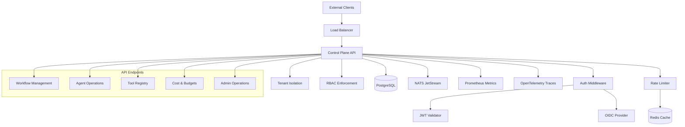
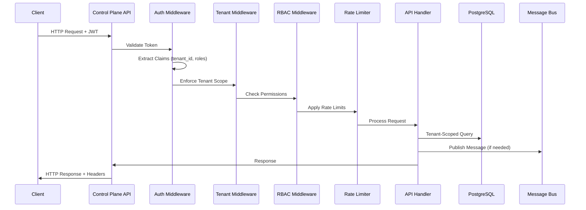

# Design Document - Control Plane API Skeleton

## Overview

The Control Plane API Skeleton provides a production-ready HTTP/REST API layer for AgentFlow, serving as the primary interface for external clients. The design emphasizes security-first architecture with multi-tenancy, comprehensive observability, and enterprise-grade controls for cost management and data sovereignty.

This design leverages the existing Q1.3 PostgreSQL schema with multi-tenant isolation, Q1.2 NATS messaging with trace propagation, and Q1.1 security tooling foundation to deliver a robust API platform that enables Q2 enterprise features.

## Architecture

### High-Level Architecture



### Request Flow Architecture



## Components and Interfaces

### 1. HTTP Server & Middleware Stack

**Core Server Configuration:**
```go
type ServerConfig struct {
    Port              int           `env:"AF_API_PORT" default:"8080"`
    ReadTimeout       time.Duration `env:"AF_API_READ_TIMEOUT" default:"30s"`
    WriteTimeout      time.Duration `env:"AF_API_WRITE_TIMEOUT" default:"30s"`
    IdleTimeout       time.Duration `env:"AF_API_IDLE_TIMEOUT" default:"120s"`
    MaxHeaderBytes    int           `env:"AF_API_MAX_HEADER_BYTES" default:"1048576"`
    EnableTLS         bool          `env:"AF_API_TLS_ENABLED" default:"false"`
    TLSCertPath       string        `env:"AF_API_TLS_CERT_PATH"`
    TLSKeyPath        string        `env:"AF_API_TLS_KEY_PATH"`
}
```

**Middleware Chain (Applied in Order):**
1. **Recovery Middleware**: Panic recovery with structured error responses
2. **Logging Middleware**: Request/response logging with correlation IDs
3. **Tracing Middleware**: OpenTelemetry span creation and context propagation
4. **Authentication Middleware**: JWT validation and claims extraction
5. **Tenant Isolation Middleware**: Tenant scoping and cross-tenant protection
6. **RBAC Middleware**: Role-based permission enforcement
7. **Rate Limiting Middleware**: Redis-based rate limiting with quotas
8. **Data Minimization Middleware**: PII redaction (feature flag controlled)

### 2. Authentication & JWT Management

**JWT Claims Structure:**
```go
type AgentFlowClaims struct {
    TenantID    string   `json:"tenant_id"`
    UserID      string   `json:"user_id"`
    Roles       []string `json:"roles"`
    Permissions []string `json:"permissions"`
    jwt.RegisteredClaims
}
```

**Authentication Interface:**
```go
type Authenticator interface {
    ValidateToken(ctx context.Context, token string) (*AgentFlowClaims, error)
    IssueToken(ctx context.Context, req *TokenRequest) (*TokenResponse, error)
    RefreshToken(ctx context.Context, refreshToken string) (*TokenResponse, error)
    RevokeToken(ctx context.Context, token string) error
}
```

**OIDC Integration (Optional):**
- Feature flag: `oidc.enabled`
- Supports external identity providers (Auth0, Okta, Azure AD)
- Falls back to internal JWT when disabled
- Configurable issuer validation and key rotation

### 3. Multi-Tenancy Architecture

**Tenant Context Propagation:**
```go
type TenantContext struct {
    TenantID     string
    TenantName   string
    Permissions  []string
    ResourceLimits map[string]interface{}
}

func WithTenantContext(ctx context.Context, tenant *TenantContext) context.Context
func GetTenantContext(ctx context.Context) (*TenantContext, error)
```

**Database Query Scoping:**
- All queries automatically include `WHERE tenant_id = $1`
- Prepared statement templates with tenant parameter injection
- Query builder with automatic tenant scoping
- Cross-tenant access detection and blocking

**Message Bus Subject Prefixes:**
- Pattern: `{tenant_id}.{stream}.{subject}`
- Example: `tenant123.workflows.execution.started`
- Automatic subject prefixing in message publishing
- Consumer filtering by tenant prefix

### 4. RBAC Implementation

**Role Definitions:**
```go
type Role struct {
    Name        string   `json:"name"`
    Permissions []string `json:"permissions"`
    Description string   `json:"description"`
}

// Predefined roles
var (
    AdminRole = Role{
        Name: "admin",
        Permissions: []string{
            "workflows:*", "agents:*", "tools:*", 
            "budgets:*", "users:*", "tenants:*",
        },
    }
    DeveloperRole = Role{
        Name: "developer", 
        Permissions: []string{
            "workflows:read", "workflows:write", "workflows:execute",
            "agents:read", "agents:write", "tools:read", "budgets:read",
        },
    }
    ViewerRole = Role{
        Name: "viewer",
        Permissions: []string{
            "workflows:read", "agents:read", "tools:read", "budgets:read",
        },
    }
)
```

**Permission Enforcement:**
```go
type PermissionChecker interface {
    HasPermission(ctx context.Context, resource, action string) (bool, error)
    RequirePermission(ctx context.Context, resource, action string) error
    GetUserPermissions(ctx context.Context, userID string) ([]string, error)
}
```

### 5. Rate Limiting & Quota Management

**Rate Limiter Configuration:**
```go
type RateLimitConfig struct {
    Algorithm    string        `env:"AF_RATE_LIMIT_ALGORITHM" default:"sliding_window"`
    WindowSize   time.Duration `env:"AF_RATE_LIMIT_WINDOW" default:"1m"`
    MaxRequests  int           `env:"AF_RATE_LIMIT_MAX_REQUESTS" default:"1000"`
    BurstSize    int           `env:"AF_RATE_LIMIT_BURST_SIZE" default:"100"`
    RedisURL     string        `env:"AF_REDIS_URL"`
}
```

**Rate Limiting Strategies:**
- **Per-Tenant Limits**: Configurable limits per tenant with Redis storage
- **Per-Endpoint Limits**: Different limits for read vs write operations
- **Burst Handling**: Token bucket algorithm for handling traffic spikes
- **Quota Headers**: Standard HTTP headers (X-RateLimit-Limit, X-RateLimit-Remaining)

### 6. OpenAPI Specification & SDK Generation

**API Documentation Structure:**
```yaml
openapi: 3.0.3
info:
  title: AgentFlow Control Plane API
  version: 1.0.0
  description: Production-ready multi-agent orchestration platform
security:
  - bearerAuth: []
paths:
  /api/v1/workflows:
    get:
      summary: List workflows
      parameters:
        - name: tenant_id
          in: header
          required: true
          schema:
            type: string
```

**SDK Generation Pipeline:**
- **OpenAPI Generator**: Automated SDK generation for Python, JavaScript, Go
- **CI/CD Integration**: Automatic SDK publishing on API changes
- **Breaking Change Detection**: Semantic versioning with compatibility checks
- **Documentation**: Interactive API explorer with authentication examples

### 7. Cost Estimation Engine

**Cost Model Architecture:**
```go
type PlanCostModel interface {
    EstimateCost(ctx context.Context, plan *WorkflowPlan) (*CostEstimate, error)
    GetTokenCosts(ctx context.Context, modelProvider string) (*TokenCosts, error)
    GetToolCosts(ctx context.Context, toolID string) (*ToolCosts, error)
    UpdateCostModel(ctx context.Context, observations []*CostObservation) error
}

type CostEstimate struct {
    TotalCost     decimal.Decimal            `json:"total_cost"`
    Currency      string                     `json:"currency"`
    Breakdown     map[string]decimal.Decimal `json:"breakdown"`
    Confidence    float64                    `json:"confidence"`
    EstimatedAt   time.Time                  `json:"estimated_at"`
    ValidUntil    time.Time                  `json:"valid_until"`
}
```

**Cost Estimation Process:**
1. **Plan Analysis**: Parse workflow plan for model calls and tool usage
2. **Token Estimation**: Estimate token usage based on prompt templates and context
3. **Tool Cost Calculation**: Apply tool-specific cost models (time-based, usage-based)
4. **Confidence Scoring**: Provide confidence intervals based on historical accuracy
5. **Budget Validation**: Check against tenant budgets and warn on overages

### 8. Tool Permission & Security Profiles

**ExecProfile Compiler:**
```go
type ExecProfile struct {
    ToolID          string            `json:"tool_id"`
    Permissions     []Permission      `json:"permissions"`
    ResourceLimits  ResourceLimits    `json:"resource_limits"`
    NetworkPolicy   NetworkPolicy     `json:"network_policy"`
    TimeoutSeconds  int               `json:"timeout_seconds"`
    AllowedHosts    []string          `json:"allowed_hosts"`
    Environment     map[string]string `json:"environment"`
}

type Permission struct {
    Type     string   `json:"type"`     // "network", "filesystem", "database"
    Actions  []string `json:"actions"`  // "read", "write", "execute"
    Resources []string `json:"resources"` // specific resources or patterns
}
```

**Security Enforcement:**
- **Deny-by-Default**: All permissions must be explicitly granted
- **Least Privilege**: Minimal permissions for tool functionality
- **Runtime Validation**: Permission checks during tool execution
- **Audit Logging**: All permission grants and denials logged

### 9. Data Minimization & PII Protection

**Redaction Engine:**
```go
type RedactionEngine interface {
    RedactPII(ctx context.Context, data interface{}) (interface{}, error)
    AddRedactionRule(rule *RedactionRule) error
    ValidateRedaction(original, redacted interface{}) error
}

type RedactionRule struct {
    Name        string `json:"name"`
    Pattern     string `json:"pattern"`     // regex pattern
    Replacement string `json:"replacement"` // replacement text
    DataTypes   []string `json:"data_types"` // "logs", "api_responses", "audit"
}
```

**PII Detection Patterns:**
- Email addresses, phone numbers, SSNs
- Credit card numbers, IP addresses
- Custom patterns per tenant
- Context-aware redaction (preserve data utility)

### 10. Residency & Data Sovereignty

**Residency Policy Engine:**
```go
type ResidencyPolicy struct {
    StrictMode      bool     `json:"strict_mode"`
    AllowedRegions  []string `json:"allowed_regions"`
    AllowedHosts    []string `json:"allowed_hosts"`
    BlockedCountries []string `json:"blocked_countries"`
    DataClassification map[string]string `json:"data_classification"`
}

type EgressFilter interface {
    ValidateEgress(ctx context.Context, destination string, data interface{}) error
    GetAllowedHosts(ctx context.Context, tenantID string) ([]string, error)
    LogEgressAttempt(ctx context.Context, attempt *EgressAttempt) error
}
```

## Data Models

### API Request/Response Models

**Standard API Response:**
```go
type APIResponse struct {
    Success   bool        `json:"success"`
    Data      interface{} `json:"data,omitempty"`
    Error     *APIError   `json:"error,omitempty"`
    Metadata  *Metadata   `json:"metadata,omitempty"`
}

type APIError struct {
    Code    string `json:"code"`
    Message string `json:"message"`
    Details map[string]interface{} `json:"details,omitempty"`
}

type Metadata struct {
    RequestID   string    `json:"request_id"`
    Timestamp   time.Time `json:"timestamp"`
    Version     string    `json:"version"`
    RateLimit   *RateLimit `json:"rate_limit,omitempty"`
}
```

### Workflow Management Models

```go
type WorkflowRequest struct {
    Name        string                 `json:"name" validate:"required,max=100"`
    Description string                 `json:"description" validate:"max=500"`
    Definition  map[string]interface{} `json:"definition" validate:"required"`
    Tags        []string               `json:"tags" validate:"max=10,dive,max=50"`
    Enabled     bool                   `json:"enabled"`
}

type WorkflowResponse struct {
    ID          string    `json:"id"`
    TenantID    string    `json:"tenant_id"`
    Name        string    `json:"name"`
    Description string    `json:"description"`
    Status      string    `json:"status"`
    CreatedAt   time.Time `json:"created_at"`
    UpdatedAt   time.Time `json:"updated_at"`
    Version     int       `json:"version"`
}
```

## Error Handling

### Error Classification

**Error Categories:**
1. **Authentication Errors** (401): Invalid or expired tokens
2. **Authorization Errors** (403): Insufficient permissions
3. **Validation Errors** (400): Invalid request data
4. **Rate Limit Errors** (429): Quota exceeded
5. **Tenant Errors** (403): Cross-tenant access attempts
6. **Server Errors** (500): Internal system failures

**Error Response Format:**
```json
{
  "success": false,
  "error": {
    "code": "INSUFFICIENT_PERMISSIONS",
    "message": "User lacks required permission: workflows:write",
    "details": {
      "required_permission": "workflows:write",
      "user_permissions": ["workflows:read", "agents:read"],
      "resource": "workflow:123",
      "action": "update"
    }
  },
  "metadata": {
    "request_id": "req_abc123",
    "timestamp": "2025-01-15T10:30:00Z"
  }
}
```

### Circuit Breaker Pattern

**External Service Protection:**
- Database connection pooling with circuit breakers
- Redis rate limiter with fallback to in-memory
- OIDC provider with graceful degradation
- Message bus with retry policies

## Testing Strategy

### Unit Testing
- **Middleware Testing**: Isolated testing of each middleware component
- **Authentication Testing**: JWT validation, OIDC integration, token lifecycle
- **RBAC Testing**: Permission matrix validation, role inheritance
- **Rate Limiting Testing**: Algorithm correctness, Redis integration
- **Cost Estimation Testing**: Model accuracy, confidence intervals

### Integration Testing
- **End-to-End API Testing**: Full request/response cycles with authentication
- **Multi-Tenancy Testing**: Cross-tenant isolation validation
- **Database Integration**: Transaction handling, connection pooling
- **Message Bus Integration**: Event publishing, trace propagation

### Security Testing
- **Authentication Bypass Testing**: Token manipulation, signature validation
- **Authorization Testing**: Privilege escalation, cross-tenant access
- **Rate Limiting Testing**: Burst handling, quota enforcement
- **PII Redaction Testing**: Golden dataset validation, zero leakage verification

### Performance Testing
- **Load Testing**: Concurrent request handling, resource utilization
- **Rate Limit Testing**: Sustained load, burst capacity
- **Database Performance**: Query optimization, connection pooling
- **Memory Usage**: Middleware overhead, garbage collection impact