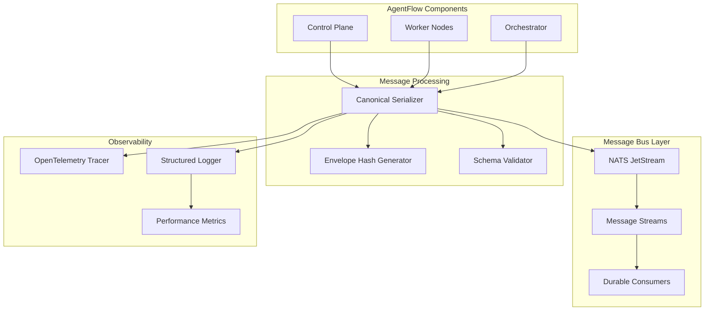
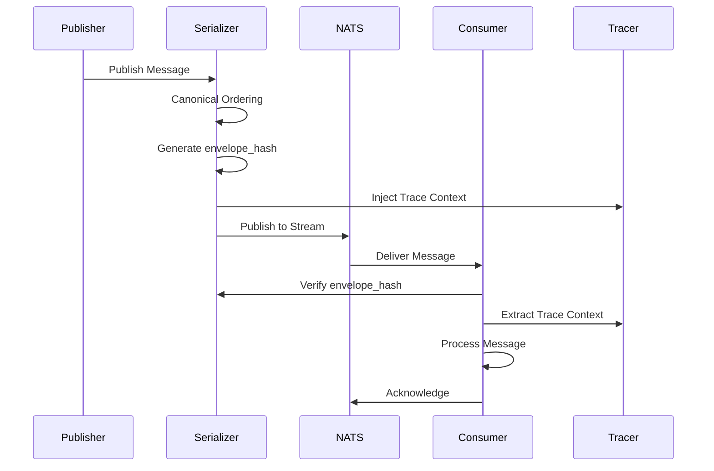

# Design Document - Messaging Backbone & Tracing Skeleton

## Overview

The Messaging Backbone & Tracing Skeleton provides the foundational communication infrastructure for AgentFlow's distributed multi-agent system. This design establishes a high-performance, tamper-evident messaging system built on NATS JetStream with comprehensive observability through OpenTelemetry tracing and structured logging.

The system achieves deterministic message processing through canonical serialization and cryptographic hashing, enabling reliable replay functionality essential for debugging and compliance. Performance targets include sub-15ms p95 message routing latency while maintaining message integrity and supporting thousands of concurrent agents.

## Architecture

### High-Level Architecture



### Message Flow Architecture



## Components and Interfaces

### Message Contract

The core message structure provides the foundation for all inter-agent communication:

```go
type Message struct {
    ID          string                 `json:"id"`          // ULID
    TraceID     string                 `json:"trace_id"`    // OpenTelemetry trace ID
    SpanID      string                 `json:"span_id"`     // OpenTelemetry span ID
    From        string                 `json:"from"`        // Source agent ID
    To          string                 `json:"to"`          // Target agent ID or topic
    Type        MessageType            `json:"type"`        // request, response, event, control
    Payload     interface{}            `json:"payload"`     // Message-specific data
    Metadata    map[string]interface{} `json:"metadata"`    // Workflow context
    Cost        CostInfo               `json:"cost"`        // Token/dollar tracking
    Timestamp   time.Time              `json:"ts"`          // RFC3339 timestamp
    EnvelopeHash string                `json:"envelope_hash"` // SHA256 of canonical content
}

type MessageType string
const (
    MessageTypeRequest  MessageType = "request"
    MessageTypeResponse MessageType = "response"
    MessageTypeEvent    MessageType = "event"
    MessageTypeControl  MessageType = "control"
)

type CostInfo struct {
    Tokens  int     `json:"tokens"`
    Dollars float64 `json:"dollars"`
}
```

### Canonical Serializer

The canonical serializer ensures deterministic message hashing:

```go
type CanonicalSerializer interface {
    Serialize(msg *Message) ([]byte, error)
    Deserialize(data []byte) (*Message, error)
    ComputeHash(msg *Message) (string, error)
    ValidateHash(msg *Message) error
}

type canonicalSerializer struct {
    schema *jsonschema.Schema
}

func (s *canonicalSerializer) Serialize(msg *Message) ([]byte, error) {
    // 1. Create ordered field map
    // 2. Recursively sort all nested objects
    // 3. Marshal with consistent formatting
    // 4. Compute SHA256 hash
    // 5. Set envelope_hash field
}
```

### NATS JetStream Integration

Stream and consumer configuration for reliable message delivery:

```go
type MessageBus interface {
    Publish(ctx context.Context, subject string, msg *Message) error
    Subscribe(ctx context.Context, subject string, handler MessageHandler) (*Subscription, error)
    Replay(ctx context.Context, workflowID string, from time.Time) ([]Message, error)
    Close() error
}

type natsMessageBus struct {
    conn   *nats.Conn
    js     nats.JetStreamContext
    config *BusConfig
}

type BusConfig struct {
    URL              string        `env:"AF_BUS_URL" default:"nats://localhost:4222"`
    MaxReconnect     int           `env:"AF_BUS_MAX_RECONNECT" default:"10"`
    ReconnectWait    time.Duration `env:"AF_BUS_RECONNECT_WAIT" default:"2s"`
    AckWait          time.Duration `env:"AF_BUS_ACK_WAIT" default:"30s"`
    MaxInFlight      int           `env:"AF_BUS_MAX_IN_FLIGHT" default:"1000"`
}
```

### Subject Taxonomy

Structured NATS subjects for organized message routing:

```
workflows.<workflow_id>.in      # Inbound workflow messages
workflows.<workflow_id>.out     # Outbound workflow messages
agents.<agent_id>.in           # Agent-specific inbound messages
agents.<agent_id>.out          # Agent-specific outbound messages
tools.calls                    # Tool execution requests
tools.audit                    # Tool audit events
system.control                 # System control messages
system.health                  # Health check messages
```

### OpenTelemetry Integration

Distributed tracing integration for observability:

```go
type TracingMiddleware struct {
    tracer trace.Tracer
}

func (t *TracingMiddleware) InjectTraceContext(ctx context.Context, msg *Message) {
    span := trace.SpanFromContext(ctx)
    if span.SpanContext().IsValid() {
        msg.TraceID = span.SpanContext().TraceID().String()
        msg.SpanID = span.SpanContext().SpanID().String()
    }
}

func (t *TracingMiddleware) ExtractTraceContext(msg *Message) context.Context {
    if msg.TraceID != "" && msg.SpanID != "" {
        traceID, _ := trace.TraceIDFromHex(msg.TraceID)
        spanID, _ := trace.SpanIDFromHex(msg.SpanID)
        spanContext := trace.NewSpanContext(trace.SpanContextConfig{
            TraceID: traceID,
            SpanID:  spanID,
        })
        return trace.ContextWithSpanContext(context.Background(), spanContext)
    }
    return context.Background()
}
```

### Structured Logging

Correlation-aware logging with standardized fields:

```go
type CorrelatedLogger interface {
    WithMessage(msg *Message) Logger
    WithTrace(ctx context.Context) Logger
    Info(message string, fields ...Field)
    Error(message string, err error, fields ...Field)
    Debug(message string, fields ...Field)
}

type correlatedLogger struct {
    base   *zap.Logger
    fields []zap.Field
}

// Standard correlation fields
var (
    TraceIDField   = "trace_id"
    SpanIDField    = "span_id"
    MessageIDField = "message_id"
    WorkflowIDField = "workflow_id"
    AgentIDField   = "agent_id"
    TimestampField = "timestamp"
)
```

## Data Models

### Stream Configuration

NATS JetStream stream definitions for different message types:

```yaml
# AF_MESSAGES Stream
name: AF_MESSAGES
subjects: ["workflows.*.*", "agents.*.*"]
storage: file
max_age: 168h  # 7 days
max_bytes: 10GB
replicas: 3
retention: limits

# AF_TOOLS Stream  
name: AF_TOOLS
subjects: ["tools.*"]
storage: file
max_age: 720h  # 30 days
max_bytes: 5GB
replicas: 3
retention: limits

# AF_SYSTEM Stream
name: AF_SYSTEM
subjects: ["system.*"]
storage: file
max_age: 24h
max_bytes: 1GB
replicas: 1
retention: limits
```

### Consumer Configuration

Durable consumer setup for reliable message processing:

```go
type ConsumerConfig struct {
    Name           string        `json:"name"`
    Stream         string        `json:"stream"`
    Subject        string        `json:"subject"`
    AckWait        time.Duration `json:"ack_wait"`
    MaxInFlight    int           `json:"max_in_flight"`
    DeliverPolicy  string        `json:"deliver_policy"`
    ReplayPolicy   string        `json:"replay_policy"`
}

// Example consumer configurations
var DefaultConsumers = []ConsumerConfig{
    {
        Name:          "workflow-processor",
        Stream:        "AF_MESSAGES",
        Subject:       "workflows.*.in",
        AckWait:       30 * time.Second,
        MaxInFlight:   100,
        DeliverPolicy: "all",
        ReplayPolicy:  "instant",
    },
    {
        Name:          "agent-processor", 
        Stream:        "AF_MESSAGES",
        Subject:       "agents.*.in",
        AckWait:       30 * time.Second,
        MaxInFlight:   50,
        DeliverPolicy: "all",
        ReplayPolicy:  "instant",
    },
}
```

## Error Handling

### Error Classification

Structured error handling with retry policies:

```go
type MessageError struct {
    Code      ErrorCode `json:"code"`
    Message   string    `json:"message"`
    Retryable bool      `json:"retryable"`
    Details   map[string]interface{} `json:"details,omitempty"`
}

type ErrorCode string
const (
    ErrorCodeValidation    ErrorCode = "validation_error"
    ErrorCodeSerialization ErrorCode = "serialization_error"
    ErrorCodeTransport     ErrorCode = "transport_error"
    ErrorCodeTimeout       ErrorCode = "timeout_error"
    ErrorCodeHashMismatch  ErrorCode = "hash_mismatch"
    ErrorCodeSchemaError   ErrorCode = "schema_error"
)

type RetryPolicy struct {
    MaxAttempts   int           `json:"max_attempts"`
    InitialDelay  time.Duration `json:"initial_delay"`
    MaxDelay      time.Duration `json:"max_delay"`
    Multiplier    float64       `json:"multiplier"`
    Jitter        bool          `json:"jitter"`
}
```

### Circuit Breaker

Circuit breaker pattern for resilient message processing:

```go
type CircuitBreaker interface {
    Execute(fn func() error) error
    State() CircuitState
}

type CircuitState string
const (
    StateClosed   CircuitState = "closed"
    StateOpen     CircuitState = "open"
    StateHalfOpen CircuitState = "half_open"
)
```

## Testing Strategy

### Unit Testing

Comprehensive unit test coverage for core components:

1. **Canonical Serializer Tests**
   - Deterministic hash generation
   - Field ordering consistency
   - Schema validation
   - Backward compatibility

2. **Message Bus Tests**
   - Publish/subscribe functionality
   - Durable consumer behavior
   - Replay sequence ordering
   - Error handling and retries

3. **Tracing Integration Tests**
   - Trace context injection/extraction
   - Span continuity across messages
   - Correlation ID propagation

### Integration Testing

End-to-end testing scenarios:

1. **Message Flow Tests**
   - Multi-hop message routing
   - Trace continuity validation
   - Performance under load

2. **Replay Testing**
   - Chronological message ordering
   - Hash verification during replay
   - State consistency checks

3. **Failure Scenarios**
   - Network partition recovery
   - Consumer failure handling
   - Message redelivery behavior

### Performance Testing

Benchmarking and performance validation:

1. **Latency Benchmarks**
   - Message routing p50/p95 latency
   - Serialization/deserialization overhead
   - Hash computation performance

2. **Throughput Testing**
   - Messages per second capacity
   - Concurrent consumer scaling
   - Memory usage under load

3. **Stress Testing**
   - Extended duration testing
   - Resource exhaustion scenarios
   - Recovery time measurement

## Performance Considerations

### Optimization Strategies

1. **Message Pooling**
   - Reuse message objects to reduce GC pressure
   - Pre-allocated byte buffers for serialization

2. **Batch Processing**
   - Batch message acknowledgments
   - Bulk hash verification operations

3. **Caching**
   - Schema validation result caching
   - Compiled regex patterns for subject matching

4. **Connection Management**
   - Connection pooling for NATS clients
   - Keep-alive configuration optimization

### Monitoring and Metrics

Key performance indicators:

```go
var (
    MessageLatencyHistogram = prometheus.NewHistogramVec(
        prometheus.HistogramOpts{
            Name: "agentflow_message_latency_seconds",
            Help: "Message processing latency",
            Buckets: prometheus.ExponentialBuckets(0.001, 2, 10),
        },
        []string{"message_type", "subject"},
    )
    
    MessageThroughputCounter = prometheus.NewCounterVec(
        prometheus.CounterOpts{
            Name: "agentflow_messages_total",
            Help: "Total messages processed",
        },
        []string{"message_type", "status"},
    )
    
    HashVerificationCounter = prometheus.NewCounterVec(
        prometheus.CounterOpts{
            Name: "agentflow_hash_verifications_total", 
            Help: "Hash verification results",
        },
        []string{"status"},
    )
)
```

## Security Considerations

### Message Integrity

1. **Envelope Hash Verification**
   - SHA256 hashing of canonical message content
   - Tamper detection on message receipt
   - Audit logging of hash mismatches

2. **Schema Validation**
   - Strict JSON schema enforcement
   - Input sanitization and validation
   - Rejection of malformed messages

### Transport Security

1. **TLS Encryption**
   - Encrypted NATS connections
   - Certificate validation
   - Cipher suite configuration

2. **Authentication**
   - NATS authentication tokens
   - Client certificate authentication
   - Subject-based authorization

## Deployment Considerations

### Configuration Management

Environment-based configuration with sensible defaults:

```yaml
# Development Configuration
message_bus:
  url: "nats://localhost:4222"
  max_reconnect: 5
  reconnect_wait: "1s"
  ack_wait: "10s"
  
tracing:
  enabled: true
  endpoint: "http://localhost:14268/api/traces"
  sample_rate: 1.0
  
logging:
  level: "debug"
  format: "json"
  correlation_fields: ["trace_id", "span_id", "message_id"]

# Production Configuration  
message_bus:
  url: "nats://nats-cluster:4222"
  max_reconnect: 10
  reconnect_wait: "2s"
  ack_wait: "30s"
  
tracing:
  enabled: true
  endpoint: "http://jaeger-collector:14268/api/traces"
  sample_rate: 0.1
  
logging:
  level: "info"
  format: "json"
  correlation_fields: ["trace_id", "span_id", "message_id", "workflow_id"]
```

### Scalability Planning

1. **Horizontal Scaling**
   - Multiple NATS server clustering
   - Consumer group load balancing
   - Partition-based message routing

2. **Vertical Scaling**
   - Memory allocation tuning
   - CPU affinity optimization
   - Network buffer sizing

This design provides a robust foundation for AgentFlow's messaging infrastructure while maintaining the flexibility needed for future enhancements and scaling requirements.