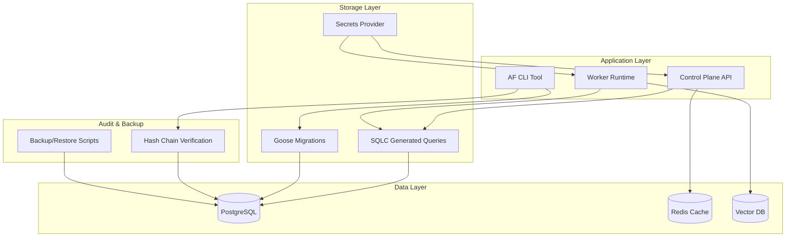

# Design Document - Relational Storage & Migrations

## Overview

The AgentFlow relational storage system provides the foundational data layer for the entire platform, built on PostgreSQL with strict multi-tenant isolation, tamper-evident audit trails, and cross-platform migration support. This design implements a production-ready storage architecture that supports all AgentFlow core entities while maintaining security, performance, and reliability requirements.

The storage system integrates with the messaging backbone (Q1.2) through envelope hash persistence and enables all subsequent components including the control plane API, orchestrator, and worker runtime. The design emphasizes security-first principles with hash-chain audit integrity, comprehensive backup/restore capabilities, and secure secrets management.

## Architecture

### Database Architecture



### Multi-Tenant Data Model

All core entities are scoped by `tenant_id` to ensure complete isolation:

```sql
-- Core tenant isolation pattern
CREATE TABLE tenants (
    id UUID PRIMARY KEY DEFAULT uuid_generate_v4(),
    name VARCHAR(255) NOT NULL UNIQUE,
    tier VARCHAR(50) NOT NULL DEFAULT 'free',
    created_at TIMESTAMP WITH TIME ZONE DEFAULT NOW(),
    updated_at TIMESTAMP WITH TIME ZONE DEFAULT NOW()
);

-- Example tenant-scoped entity
CREATE TABLE agents (
    id UUID PRIMARY KEY DEFAULT uuid_generate_v4(),
    tenant_id UUID NOT NULL REFERENCES tenants(id) ON DELETE CASCADE,
    name VARCHAR(255) NOT NULL,
    type VARCHAR(100) NOT NULL,
    config_json JSONB NOT NULL DEFAULT '{}',
    created_at TIMESTAMP WITH TIME ZONE DEFAULT NOW(),
    UNIQUE(tenant_id, name)
);
```

## Components and Interfaces

### 1. Migration System (Goose + SQLC)

**Migration Management:**
- **Tool**: Goose v3.17.0 for schema migrations
- **Pattern**: Timestamped migrations with up/down support
- **Naming**: `YYYYMMDDHHMMSS_descriptive_name.sql`
- **Reversibility**: All migrations must include functional down migrations

**Type-Safe Query Generation:**
- **Tool**: SQLC v1.25.0 for Go code generation
- **Pattern**: SQL queries in `.sql` files with annotations
- **Output**: Type-safe Go structs and functions
- **Integration**: Generated code in `internal/storage/queries/`

```yaml
# sqlc.yaml configuration
version: "2"
sql:
  - engine: "postgresql"
    queries: "internal/storage/queries"
    schema: "migrations"
    gen:
      go:
        package: "queries"
        out: "internal/storage/queries"
        sql_package: "pgx/v5"
        emit_json_tags: true
        emit_interface: true
```

### 2. Audit Hash-Chain System

**Hash-Chain Implementation:**
```sql
CREATE TABLE audits (
    id UUID PRIMARY KEY DEFAULT uuid_generate_v4(),
    tenant_id UUID NOT NULL REFERENCES tenants(id),
    actor_type VARCHAR(50) NOT NULL,
    actor_id VARCHAR(255) NOT NULL,
    action VARCHAR(100) NOT NULL,
    resource_type VARCHAR(100) NOT NULL,
    resource_id VARCHAR(255),
    details JSONB NOT NULL DEFAULT '{}',
    ts TIMESTAMP WITH TIME ZONE DEFAULT NOW(),
    prev_hash BYTEA,
    hash BYTEA NOT NULL
);
```

**Hash Computation:**
- **Algorithm**: SHA256(prev_hash || canonical_json(audit_record))
- **Ordering**: Chronological by timestamp with sequence numbers
- **Verification**: CLI command `af audit verify` validates entire chain
- **Performance**: Target ≥10k entries/sec verification throughput

### 3. Message Envelope Hash Persistence

**Integration with Q1.2 Messaging:**
```sql
CREATE TABLE messages (
    id UUID PRIMARY KEY,
    tenant_id UUID NOT NULL REFERENCES tenants(id),
    trace_id VARCHAR(32),
    span_id VARCHAR(16),
    from_agent VARCHAR(255) NOT NULL,
    to_agent VARCHAR(255) NOT NULL,
    type VARCHAR(20) NOT NULL,
    payload JSONB NOT NULL DEFAULT '{}',
    metadata JSONB NOT NULL DEFAULT '{}',
    cost JSONB NOT NULL DEFAULT '{}',
    ts TIMESTAMP WITH TIME ZONE NOT NULL,
    envelope_hash VARCHAR(64) NOT NULL -- SHA256 from Q1.2
);
```

**Integrity Validation:**
- **Storage**: Envelope hash from Q1.2 canonical serializer
- **Validation**: Recompute hash on retrieval and compare
- **Replay**: Use hash to verify message authenticity during replay
- **Rejection**: Invalid or missing hashes cause insertion failure

### 4. Development Services Bootstrap

**Docker Compose Services:**
```yaml
version: '3.8'
services:
  postgres:
    image: postgres:15-alpine
    environment:
      POSTGRES_DB: agentflow_dev
      POSTGRES_USER: agentflow
      POSTGRES_PASSWORD: dev_password
    ports:
      - "5432:5432"
    volumes:
      - postgres_data:/var/lib/postgresql/data
    healthcheck:
      test: ["CMD-SHELL", "pg_isready -U agentflow"]
      interval: 10s
      timeout: 5s
      retries: 5

  redis:
    image: redis:7-alpine
    ports:
      - "6379:6379"
    healthcheck:
      test: ["CMD", "redis-cli", "ping"]
      interval: 10s
      timeout: 3s
      retries: 3

  vector-db:
    image: qdrant/qdrant:latest
    ports:
      - "6333:6333"
    volumes:
      - vector_data:/qdrant/storage
    healthcheck:
      test: ["CMD", "curl", "-f", "http://localhost:6333/health"]
      interval: 15s
      timeout: 10s
      retries: 3
```

### 5. Secrets Provider Interface

**Provider Interface:**
```go
type SecretsProvider interface {
    GetSecret(ctx context.Context, key string) (string, error)
    SetSecret(ctx context.Context, key, value string) error
    DeleteSecret(ctx context.Context, key string) error
    ListSecrets(ctx context.Context) ([]string, error)
    Rotate(ctx context.Context, key string) error
}

type EnvironmentProvider struct{}
type FileProvider struct {
    configPath string
}
```

**Security Features:**
- **Masking**: Automatic masking in logs and debug output
- **Rotation**: Hot reload without application restart
- **Validation**: Permission checks and access logging
- **Fallback**: Graceful degradation on provider failures

## Data Models

### Core Schema Tables

**Tenants & Users:**
```sql
CREATE TABLE tenants (
    id UUID PRIMARY KEY DEFAULT uuid_generate_v4(),
    name VARCHAR(255) NOT NULL UNIQUE,
    tier VARCHAR(50) NOT NULL DEFAULT 'free',
    settings JSONB NOT NULL DEFAULT '{}',
    created_at TIMESTAMP WITH TIME ZONE DEFAULT NOW(),
    updated_at TIMESTAMP WITH TIME ZONE DEFAULT NOW()
);

CREATE TABLE users (
    id UUID PRIMARY KEY DEFAULT uuid_generate_v4(),
    tenant_id UUID NOT NULL REFERENCES tenants(id) ON DELETE CASCADE,
    email VARCHAR(255) NOT NULL,
    role VARCHAR(50) NOT NULL DEFAULT 'viewer',
    hashed_secret VARCHAR(255),
    created_at TIMESTAMP WITH TIME ZONE DEFAULT NOW(),
    updated_at TIMESTAMP WITH TIME ZONE DEFAULT NOW(),
    UNIQUE(tenant_id, email)
);
```

**Agents & Workflows:**
```sql
CREATE TABLE agents (
    id UUID PRIMARY KEY DEFAULT uuid_generate_v4(),
    tenant_id UUID NOT NULL REFERENCES tenants(id) ON DELETE CASCADE,
    name VARCHAR(255) NOT NULL,
    type VARCHAR(100) NOT NULL,
    role VARCHAR(100),
    config_json JSONB NOT NULL DEFAULT '{}',
    policies_json JSONB NOT NULL DEFAULT '{}',
    created_at TIMESTAMP WITH TIME ZONE DEFAULT NOW(),
    updated_at TIMESTAMP WITH TIME ZONE DEFAULT NOW(),
    UNIQUE(tenant_id, name)
);

CREATE TABLE workflows (
    id UUID PRIMARY KEY DEFAULT uuid_generate_v4(),
    tenant_id UUID NOT NULL REFERENCES tenants(id) ON DELETE CASCADE,
    name VARCHAR(255) NOT NULL,
    version VARCHAR(50) NOT NULL DEFAULT '1.0.0',
    config_yaml TEXT NOT NULL,
    planner_type VARCHAR(50) NOT NULL,
    template_version_constraint VARCHAR(100),
    created_at TIMESTAMP WITH TIME ZONE DEFAULT NOW(),
    updated_at TIMESTAMP WITH TIME ZONE DEFAULT NOW(),
    UNIQUE(tenant_id, name, version)
);
```

**Plans & Messages:**
```sql
CREATE TABLE plans (
    id UUID PRIMARY KEY DEFAULT uuid_generate_v4(),
    workflow_id UUID NOT NULL REFERENCES workflows(id) ON DELETE CASCADE,
    state JSONB NOT NULL DEFAULT '{}',
    steps JSONB NOT NULL DEFAULT '[]',
    assignments JSONB NOT NULL DEFAULT '{}',
    cost JSONB NOT NULL DEFAULT '{}',
    created_at TIMESTAMP WITH TIME ZONE DEFAULT NOW(),
    updated_at TIMESTAMP WITH TIME ZONE DEFAULT NOW()
);

-- Messages table (from Q1.2 integration)
CREATE TABLE messages (
    id UUID PRIMARY KEY,
    tenant_id UUID NOT NULL REFERENCES tenants(id) ON DELETE CASCADE,
    trace_id VARCHAR(32),
    span_id VARCHAR(16),
    from_agent VARCHAR(255) NOT NULL,
    to_agent VARCHAR(255) NOT NULL,
    type VARCHAR(20) NOT NULL CHECK (type IN ('request', 'response', 'event', 'control')),
    payload JSONB NOT NULL DEFAULT '{}',
    metadata JSONB NOT NULL DEFAULT '{}',
    cost JSONB NOT NULL DEFAULT '{}',
    ts TIMESTAMP WITH TIME ZONE NOT NULL,
    envelope_hash VARCHAR(64) NOT NULL
);
```

**Tools & Audits:**
```sql
CREATE TABLE tools (
    id UUID PRIMARY KEY DEFAULT uuid_generate_v4(),
    tenant_id UUID NOT NULL REFERENCES tenants(id) ON DELETE CASCADE,
    name VARCHAR(255) NOT NULL,
    schema JSONB NOT NULL,
    permissions JSONB NOT NULL DEFAULT '{}',
    cost_model JSONB NOT NULL DEFAULT '{}',
    created_at TIMESTAMP WITH TIME ZONE DEFAULT NOW(),
    updated_at TIMESTAMP WITH TIME ZONE DEFAULT NOW(),
    UNIQUE(tenant_id, name)
);

CREATE TABLE audits (
    id UUID PRIMARY KEY DEFAULT uuid_generate_v4(),
    tenant_id UUID NOT NULL REFERENCES tenants(id) ON DELETE CASCADE,
    actor_type VARCHAR(50) NOT NULL,
    actor_id VARCHAR(255) NOT NULL,
    action VARCHAR(100) NOT NULL,
    resource_type VARCHAR(100) NOT NULL,
    resource_id VARCHAR(255),
    details JSONB NOT NULL DEFAULT '{}',
    ts TIMESTAMP WITH TIME ZONE DEFAULT NOW(),
    prev_hash BYTEA,
    hash BYTEA NOT NULL
);
```

**Budgets & RBAC:**
```sql
CREATE TABLE budgets (
    id UUID PRIMARY KEY DEFAULT uuid_generate_v4(),
    tenant_id UUID NOT NULL REFERENCES tenants(id) ON DELETE CASCADE,
    name VARCHAR(255) NOT NULL,
    type VARCHAR(50) NOT NULL, -- 'workflow', 'user', 'global'
    resource_id UUID, -- workflow_id, user_id, or NULL for global
    limits JSONB NOT NULL DEFAULT '{}', -- token limits, dollar limits, etc.
    current_usage JSONB NOT NULL DEFAULT '{}',
    period VARCHAR(50) NOT NULL DEFAULT 'monthly',
    created_at TIMESTAMP WITH TIME ZONE DEFAULT NOW(),
    updated_at TIMESTAMP WITH TIME ZONE DEFAULT NOW(),
    UNIQUE(tenant_id, name)
);

CREATE TABLE rbac_roles (
    id UUID PRIMARY KEY DEFAULT uuid_generate_v4(),
    tenant_id UUID NOT NULL REFERENCES tenants(id) ON DELETE CASCADE,
    name VARCHAR(100) NOT NULL,
    permissions JSONB NOT NULL DEFAULT '[]',
    created_at TIMESTAMP WITH TIME ZONE DEFAULT NOW(),
    UNIQUE(tenant_id, name)
);

CREATE TABLE rbac_bindings (
    id UUID PRIMARY KEY DEFAULT uuid_generate_v4(),
    tenant_id UUID NOT NULL REFERENCES tenants(id) ON DELETE CASCADE,
    user_id UUID NOT NULL REFERENCES users(id) ON DELETE CASCADE,
    role_id UUID NOT NULL REFERENCES rbac_roles(id) ON DELETE CASCADE,
    created_at TIMESTAMP WITH TIME ZONE DEFAULT NOW(),
    UNIQUE(tenant_id, user_id, role_id)
);
```

### Indexes and Performance

**Primary Indexes:**
```sql
-- Tenant isolation indexes
CREATE INDEX idx_users_tenant_id ON users(tenant_id);
CREATE INDEX idx_agents_tenant_id ON agents(tenant_id);
CREATE INDEX idx_workflows_tenant_id ON workflows(tenant_id);
CREATE INDEX idx_plans_workflow_id ON plans(workflow_id);
CREATE INDEX idx_messages_tenant_id ON messages(tenant_id);
CREATE INDEX idx_tools_tenant_id ON tools(tenant_id);
CREATE INDEX idx_audits_tenant_id ON audits(tenant_id);
CREATE INDEX idx_budgets_tenant_id ON budgets(tenant_id);

-- Query performance indexes
CREATE INDEX idx_messages_trace_id ON messages(trace_id);
CREATE INDEX idx_messages_ts ON messages(ts);
CREATE INDEX idx_audits_ts ON audits(ts);
CREATE INDEX idx_audits_actor ON audits(tenant_id, actor_type, actor_id);
CREATE INDEX idx_plans_state ON plans USING GIN(state);
CREATE INDEX idx_workflows_planner_type ON workflows(tenant_id, planner_type);
```

## Error Handling

### Migration Error Recovery

**Failure Scenarios:**
1. **Syntax Errors**: Invalid SQL in migration files
2. **Constraint Violations**: Data doesn't meet new constraints
3. **Lock Timeouts**: Long-running migrations block operations
4. **Disk Space**: Large operations exceed available space

**Recovery Procedures:**
1. **Automatic Rollback**: Failed migrations trigger automatic down migration
2. **Manual Intervention**: Complex failures require manual database fixes
3. **Data Cleanup**: Pre-migration data validation and cleanup scripts
4. **Maintenance Windows**: Schedule large migrations during low-traffic periods

### Hash-Chain Integrity Failures

**Detection Methods:**
1. **Periodic Verification**: Scheduled `af audit verify` runs
2. **Real-time Validation**: Hash verification on audit record insertion
3. **Tamper Alerts**: Immediate notifications on integrity failures

**Response Procedures:**
1. **Incident Response**: Immediate security team notification
2. **Forensic Analysis**: Identify tampered records and timeline
3. **Recovery**: Restore from known-good backup if necessary
4. **Prevention**: Enhanced access controls and monitoring

## Testing Strategy

### Unit Testing

**SQLC Generated Code:**
- Compilation tests for all generated queries
- Parameter binding validation
- Result mapping verification
- Error handling coverage

**Migration Testing:**
- Forward migration application
- Backward migration rollback
- Schema consistency validation
- Cross-platform path handling

**Hash-Chain Testing:**
- Integrity computation accuracy
- Tamper detection sensitivity
- Performance benchmarking
- Concurrent access safety

### Integration Testing

**End-to-End Workflows:**
- Fresh database setup and migration
- Seed data insertion and validation
- Rollback and re-migration cycles
- Service health check validation

**Cross-Platform Testing:**
- Linux migration execution
- Windows path handling
- WSL2 compatibility
- Docker service startup

**Performance Testing:**
- Audit verification throughput (≥10k entries/sec)
- Backup/restore timing (<5 minutes)
- Query performance under load
- Concurrent migration safety

### Manual Testing Procedures

**Database Operations:**
1. Fresh migration on clean database
2. Seed test data across all tables
3. Rollback to previous migration
4. Re-apply latest migration
5. Verify data integrity and constraints

**Audit Chain Verification:**
1. Insert audit records with valid chain
2. Manually tamper with audit record in database
3. Run `af audit verify` command
4. Verify failure detection and reporting
5. Restore from backup and re-verify

**Service Integration:**
1. Start docker-compose services
2. Run `af validate` command
3. Verify Redis and vector database connectivity
4. Test service health checks
5. Simulate service failures and recovery

## Performance Considerations

### Database Optimization

**Connection Pooling:**
- Maximum connections: 100 (configurable)
- Idle timeout: 30 minutes
- Connection lifetime: 1 hour
- Health check interval: 30 seconds

**Query Optimization:**
- Prepared statements for all queries
- Appropriate indexes for tenant isolation
- JSONB GIN indexes for flexible queries
- Query plan analysis and optimization

**Backup Performance:**
- Parallel dump for large tables
- Compression for storage efficiency
- Incremental backups for large datasets
- Point-in-time recovery capability

### Memory Store Stub Performance

**In-Memory Operations:**
- Hash map storage for O(1) access
- LRU eviction for memory management
- Concurrent access with read-write locks
- Deterministic serialization for consistency

**Integration Performance:**
- Lazy initialization to reduce startup time
- Graceful degradation on memory pressure
- Clear upgrade path to Q2.6 implementation
- Feature flag for experimental usage

## Security Considerations

### Data Protection

**Encryption:**
- TLS for all database connections
- At-rest encryption for sensitive data
- Key rotation procedures
- Secure key storage

**Access Control:**
- Principle of least privilege
- Role-based access control
- Audit logging for all access
- Regular access reviews

### Audit Security

**Tamper Evidence:**
- Cryptographic hash chains
- Immutable audit records
- Real-time integrity monitoring
- Forensic analysis capabilities

**Compliance:**
- SOC 2 Type II preparation
- GDPR data handling
- HIPAA compliance for PHI
- Audit trail retention policies