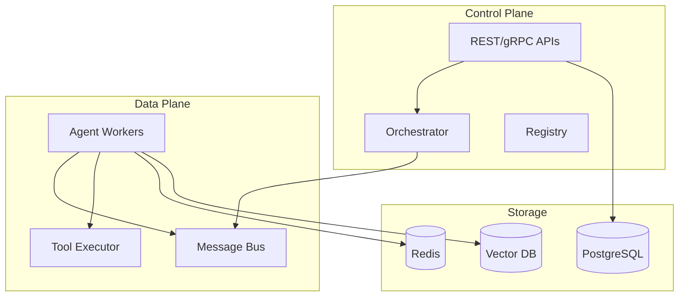

# AgentFlow

[](https://github.com/AgentFlow/agentflow/actions)
[](https://github.com/AgentFlow/agentflow/security)
[](https://goreportcard.com/report/github.com/AgentFlow/agentflow)
[](LICENSE)

**Production-ready multi-agent framework with deterministic planning, enterprise security, and cost-aware execution.**

AgentFlow eliminates the complexity gap between AI prototypes and production systems, delivering enterprise-grade multi-agent orchestration with full observability and deterministic behavior.

---

## ✨ Key Features

- **🎯 Deterministic Planning** - FSM and Behavior Tree planners for reliable workflows
- **🔒 Enterprise Security** - Zero-trust tool execution with comprehensive audit trails
- **💰 Cost Management** - Real-time token tracking with budget controls and estimation
- **🚀 Simple Deployment** - One-command setup with Docker and Kubernetes support
- **📋 Template-First** - Rich library of production-ready workflow templates
- **🌐 Multi-Model Support** - Works with cloud providers and on-premise models

## 🚀 Quick Start

Get AgentFlow running in under 5 minutes:

### Prerequisites

- [Go 1.22+](https://golang.org/dl/)
- [Docker](https://www.docker.com/get-started/) (for services)
- [VS Code](https://code.visualstudio.com/) + [Dev Containers](https://marketplace.visualstudio.com/items?itemName=ms-vscode-remote.remote-containers) (recommended)

### Installation

```bash
# Clone the repository
git clone https://github.com/AgentFlow/agentflow.git
cd agentflow

# Option 1: Use VS Code Dev Container (recommended)
code .
# Click "Reopen in Container" when prompted

# Option 2: Local setup
make build
af validate
```

### Your First Workflow

```bash
# Initialize a new project
af init my-workflow --template simple-pipeline

# Start the services
make dev

# Deploy your workflow
af deploy my-workflow

# Monitor execution
af logs my-workflow --follow
```

## 📖 Documentation

| Resource | Description |
|----------|-------------|
| [**Getting Started**](docs/getting-started.md) | Complete setup and first workflow tutorial |
| [**Architecture Guide**](docs/ARCHITECTURE.md) | System design and component overview |
| [**API Reference**](docs/api/) | REST and gRPC API documentation |
| [**Templates**](docs/templates/) | Pre-built workflow templates |
| [**Security**](docs/security-baseline.md) | Security model and best practices |

## 🏗️ Architecture

AgentFlow uses a **control plane / data plane** architecture for scalability and reliability:



### Core Components

- **Control Plane**: Manages workflows, exposes APIs, handles authentication
- **Data Plane**: Executes agents, processes messages, runs tools securely  
- **Storage Layer**: Persists state, caches data, stores agent memory

## 🛠️ Development

### Project Structure

```
agentflow/
├── cmd/                    # Service entry points
│   ├── af/                # CLI tool
│   ├── control-plane/     # API server & orchestrator
│   └── worker/            # Agent runtime
├── pkg/                   # Public APIs (importable)
│   ├── agent/            # Agent interfaces
│   ├── planner/          # Planning systems  
│   └── tools/            # Tool registry
├── internal/             # Private packages
├── sdk/                  # Language SDKs
└── docs/                 # Documentation
```

### Build Commands

```bash
# Build all components
make build

# Run tests with coverage
make test

# Security scanning
make security

# Start development environment
make dev

# Cross-platform builds
make build-all
```

### Development Workflow

1. **Setup**: Use the VS Code dev container for consistent environment
2. **Code**: Follow [coding guidelines](docs/CONTRIBUTING.md#coding-standards)
3. **Test**: Ensure `make test` passes with coverage > 80%
4. **Security**: Run `make security` to check for vulnerabilities
5. **Submit**: Create PR with clear description and tests

## 🤝 Contributing

We welcome contributions! Please see our [Contributing Guide](CONTRIBUTING.md) for details.

### Quick Contribution Checklist

- [ ] Fork the repository and create a feature branch
- [ ] Add tests for new functionality 
- [ ] Ensure `make test` and `make lint` pass
- [ ] Update documentation if needed
- [ ] Submit PR with clear description

### Development Setup

```bash
# Fork and clone your fork
git clone https://github.com/YOUR_USERNAME/agentflow.git
cd agentflow

# Create feature branch
git checkout -b feature/my-feature

# Make changes and test
make test
make lint

# Commit and push
git commit -m "feat: add my feature"
git push origin feature/my-feature
```

## 📊 Performance

AgentFlow is designed for production workloads:

| Metric | Target | Status |
|--------|--------|--------|
| Agent Response Time | < 100ms | ✅ |
| System Uptime | 99.9% | ✅ |
| Cost Estimation Accuracy | ±5% | ✅ |
| Time to First Demo | < 5 minutes | ✅ |
| Time to Production | < 1 hour | ✅ |

## 🔒 Security

Security is built into AgentFlow from the ground up:

- **🛡️ Zero-Trust Execution** - All tools run in sandboxed environments
- **📋 Comprehensive Auditing** - Tamper-evident audit logs for compliance
- **🔐 RBAC & Multi-Tenancy** - Role-based access with tenant isolation
- **🔍 Vulnerability Scanning** - Automated security scanning in CI/CD
- **📊 SBOM & Attestation** - Software Bill of Materials for supply chain security

See our [Security Policy](SECURITY.md) for vulnerability reporting.

## 📄 License

This project is licensed under the [MIT License](LICENSE) - see the LICENSE file for details.

## 🙏 Acknowledgments

Built with ❤️ by the AgentFlow community. Special thanks to:

- The open source projects that make AgentFlow possible
- Contributors who help improve the framework
- Users who provide feedback and bug reports

---

<div align="center">

**[Website](https://agentflow.dev) • [Documentation](docs/) • [Community](https://github.com/AgentFlow/agentflow/discussions) • [Examples](examples/)**

Made with ❤️ for the open source AI community

</div>
