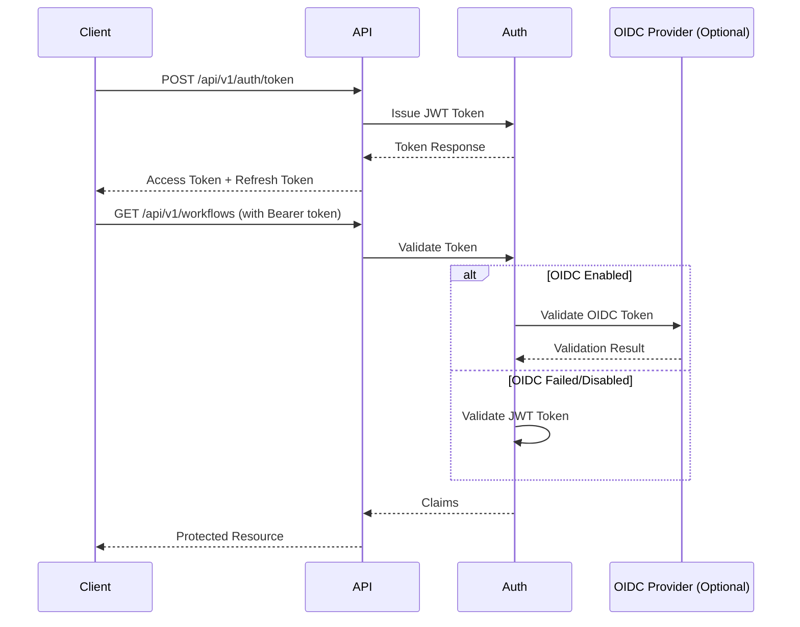

# AgentFlow Authentication System

## Overview

The AgentFlow Control Plane API implements a comprehensive authentication system supporting both JWT tokens and optional OIDC integration. The system provides secure token-based authentication with configurable expiration, revocation capabilities, and role-based access control.

## Architecture

### Components

1. **JWT Authenticator** - Core JWT token issuance and validation
2. **OIDC Provider** - Optional OpenID Connect integration
3. **Hybrid Authenticator** - Combines JWT and OIDC with graceful fallback
4. **Authentication Middleware** - HTTP middleware for request authentication
5. **Authentication Handlers** - HTTP endpoints for token management

### Authentication Flow



## Configuration

### Environment Variables

| Variable | Description | Default | Example |
|----------|-------------|---------|---------|
| `AF_JWT_SECRET` | JWT signing secret | Auto-generated | `your-secret-key-32-chars-long` |
| `AF_TOKEN_EXPIRY` | Token expiration duration | `24h` | `1h`, `30m`, `7d` |
| `AF_REFRESH_TOKEN_EXPIRY` | Refresh token expiry | `7d` | `30d` |
| `AF_OIDC_ENABLED` | Enable OIDC integration | `false` | `true` |
| `AF_OIDC_ISSUER` | OIDC provider issuer URL | - | `https://auth.example.com` |
| `AF_OIDC_CLIENT_ID` | OIDC client ID | - | `agentflow-client` |
| `AF_OIDC_CLIENT_SECRET` | OIDC client secret | - | `client-secret` |

### Development Configuration

For development environments, you can use a fixed JWT secret:

```bash
export AF_ENV=development
export AF_JWT_SECRET=dev-secret-change-in-production-32-chars
export AF_TOKEN_EXPIRY=24h
export AF_OIDC_ENABLED=false
```

### Production Configuration

For production, ensure you use a strong, randomly generated JWT secret:

```bash
export AF_JWT_SECRET=$(openssl rand -hex 32)
export AF_TOKEN_EXPIRY=1h
export AF_REFRESH_TOKEN_EXPIRY=7d
export AF_OIDC_ENABLED=true
export AF_OIDC_ISSUER=https://your-oidc-provider.com
```

## Token Structure

### JWT Claims

AgentFlow JWT tokens contain the following claims:

```json
{
  "tenant_id": "tenant-123",
  "user_id": "user-456",
  "roles": ["admin", "developer"],
  "permissions": ["workflows:*", "agents:read"],
  "iss": "agentflow-control-plane",
  "sub": "user-456",
  "aud": ["agentflow"],
  "exp": 1640995200,
  "iat": 1640908800,
  "nbf": 1640908800,
  "jti": "token-uuid"
}
```

### Token Response

Token issuance returns:

```json
{
  "success": true,
  "data": {
    "access_token": "eyJhbGciOiJIUzI1NiIsInR5cCI6IkpXVCJ9...",
    "token_type": "Bearer",
    "expires_in": 3600,
    "refresh_token": "refresh-token-string",
    "issued_at": 1640908800
  }
}
```

## API Endpoints

### Token Issuance

**POST** `/api/v1/auth/token`

Issue a new JWT token.

**Request:**
```json
{
  "tenant_id": "tenant-123",
  "user_id": "user-456",
  "roles": ["admin", "developer"],
  "permissions": ["workflows:*", "agents:read"],
  "expires_in": "1h"
}
```

**Response:**
```json
{
  "success": true,
  "data": {
    "access_token": "eyJhbGciOiJIUzI1NiIsInR5cCI6IkpXVCJ9...",
    "token_type": "Bearer",
    "expires_in": 3600,
    "refresh_token": "refresh-token-string",
    "issued_at": 1640908800
  }
}
```

### Token Validation

**POST** `/api/v1/auth/validate`

Validate an existing token.

**Headers:**
```
Authorization: Bearer <token>
```

**Response:**
```json
{
  "success": true,
  "data": {
    "valid": true,
    "tenant_id": "tenant-123",
    "user_id": "user-456",
    "roles": ["admin", "developer"],
    "permissions": ["workflows:*", "agents:read"],
    "expires_at": 1640995200,
    "issued_at": 1640908800
  }
}
```

### Token Revocation

**POST** `/api/v1/auth/revoke`

Revoke an active token.

**Headers:**
```
Authorization: Bearer <token>
```

**Response:**
```json
{
  "success": true,
  "data": {
    "revoked": true,
    "message": "Token revoked successfully"
  }
}
```

### User Information

**GET** `/api/v1/auth/userinfo`

Get information about the authenticated user.

**Headers:**
```
Authorization: Bearer <token>
```

**Response:**
```json
{
  "success": true,
  "data": {
    "user_id": "user-456",
    "tenant_id": "tenant-123",
    "roles": ["admin", "developer"],
    "permissions": ["workflows:*", "agents:read"],
    "issued_at": 1640908800,
    "expires_at": 1640995200
  }
}
```

## Middleware Integration

### Basic Authentication

```go
// Apply authentication middleware to protected routes
protectedRouter := router.PathPrefix("/api/v1").Subrouter()
protectedRouter.Use(authMiddleware.Middleware())
```

### Role-Based Access Control

```go
// Require specific roles
adminRouter := protectedRouter.PathPrefix("/admin").Subrouter()
adminRouter.Use(authMiddleware.RequireRole("admin"))

// Require multiple roles (user must have at least one)
devRouter := protectedRouter.PathPrefix("/dev").Subrouter()
devRouter.Use(authMiddleware.RequireRole("admin", "developer"))
```

### Permission-Based Access Control

```go
// Require specific permissions
workflowRouter := protectedRouter.PathPrefix("/workflows").Subrouter()
workflowRouter.Use(authMiddleware.RequirePermission("workflows", "read"))

// Different permissions for different HTTP methods
router.HandleFunc("/workflows", handler).Methods("GET").
    Subrouter().Use(authMiddleware.RequirePermission("workflows", "read"))
router.HandleFunc("/workflows", handler).Methods("POST").
    Subrouter().Use(authMiddleware.RequirePermission("workflows", "write"))
```

### Context Helpers

```go
func myHandler(w http.ResponseWriter, r *http.Request) {
    // Get authentication claims
    claims := security.GetClaimsFromContext(r.Context())
    
    // Get specific values
    tenantID := security.GetTenantIDFromContext(r.Context())
    userID := security.GetUserIDFromContext(r.Context())
    roles := security.GetUserRolesFromContext(r.Context())
    permissions := security.GetUserPermissionsFromContext(r.Context())
    
    // Check permissions
    if security.HasRole(r.Context(), "admin") {
        // Admin-only logic
    }
    
    if security.HasPermission(r.Context(), "workflows", "write") {
        // Permission-based logic
    }
}
```

## OIDC Integration

### Configuration

Enable OIDC by setting environment variables:

```bash
export AF_OIDC_ENABLED=true
export AF_OIDC_ISSUER=https://your-oidc-provider.com
export AF_OIDC_CLIENT_ID=agentflow-client
export AF_OIDC_CLIENT_SECRET=your-client-secret
```

### Provider Discovery

The system automatically discovers OIDC provider configuration from the well-known endpoint:
`{issuer}/.well-known/openid_configuration`

### Token Validation Flow

1. **OIDC First**: If OIDC is enabled, validate tokens against the OIDC provider
2. **JWT Fallback**: If OIDC validation fails, fall back to JWT validation
3. **Claims Mapping**: Convert OIDC claims to AgentFlow claims format

### Claims Mapping

OIDC claims are mapped to AgentFlow claims as follows:

| OIDC Claim | AgentFlow Claim | Notes |
|------------|-----------------|-------|
| `sub` | `user_id` | Subject identifier |
| `tenant_id` | `tenant_id` | Custom claim or derived from email |
| `roles` | `roles` | Custom claim or default to `["viewer"]` |
| `groups` | `roles` | Alternative to roles claim |
| `email` | - | Used to derive tenant_id if not present |

### Tenant Derivation

If no `tenant_id` claim is present in the OIDC token, it's derived from the email domain:

- `user@example.com` → `example-com`
- `admin@company.org` → `company-org`
- Invalid email → `default`

## Security Considerations

### JWT Security

1. **Secret Management**: Use strong, randomly generated secrets in production
2. **Token Expiry**: Use short-lived tokens (1-24 hours) with refresh tokens
3. **Revocation**: Implement token revocation for compromised tokens
4. **Signing Algorithm**: Uses HMAC-SHA256 (HS256) for signing

### OIDC Security

1. **Provider Validation**: Validate OIDC provider certificates
2. **Issuer Verification**: Ensure token issuer matches configured issuer
3. **Audience Validation**: Verify token audience claims
4. **JWKS Caching**: Cache JWKS keys with appropriate TTL

### Transport Security

1. **HTTPS Only**: Always use HTTPS in production
2. **Secure Headers**: Set appropriate security headers
3. **CORS Configuration**: Configure CORS appropriately for your domain

## Error Handling

### Common Error Responses

**Missing Authorization Header:**
```json
{
  "success": false,
  "error": {
    "code": "missing_authorization_header",
    "message": "Authorization header is required"
  }
}
```

**Invalid Token:**
```json
{
  "success": false,
  "error": {
    "code": "invalid_token",
    "message": "Token validation failed"
  }
}
```

**Insufficient Permissions:**
```json
{
  "success": false,
  "error": {
    "code": "insufficient_permissions",
    "message": "User lacks required permission: workflows:write"
  }
}
```

### Error Codes

| Code | Description | HTTP Status |
|------|-------------|-------------|
| `missing_authorization_header` | No Authorization header | 401 |
| `invalid_authorization_header` | Malformed Authorization header | 401 |
| `invalid_token` | Token validation failed | 401 |
| `insufficient_permissions` | Missing required permissions | 403 |
| `token_issuance_failed` | Failed to issue token | 500 |

## Testing

### Unit Tests

Run the authentication unit tests:

```bash
go test -v ./internal/security
```

### Manual Testing

Run manual integration tests:

```bash
# Basic authentication flow
go test -v -run TestManualAuthenticationFlow ./internal/security

# OIDC flag behavior
go test -v -run TestManualOIDCFlagToggle ./internal/security

# Token lifecycle
go test -v -run TestManualTokenLifecycle ./internal/security

# Environment configuration
go test -v -run TestManualEnvironmentConfiguration ./internal/security
```

### Integration Testing

Test with a real server:

```bash
# Start the control plane server
go run cmd/control-plane/main.go

# Issue a token
curl -X POST http://localhost:8080/api/v1/auth/token \
  -H "Content-Type: application/json" \
  -d '{
    "tenant_id": "test-tenant",
    "user_id": "test-user",
    "roles": ["admin"]
  }'

# Use the token to access protected endpoints
curl -H "Authorization: Bearer <token>" \
  http://localhost:8080/api/v1/workflows
```

## Troubleshooting

### Common Issues

**Token Expired:**
- Check token expiry configuration
- Implement token refresh logic
- Verify system clock synchronization

**OIDC Discovery Failed:**
- Verify OIDC issuer URL is accessible
- Check network connectivity
- Validate OIDC provider configuration

**Permission Denied:**
- Verify user roles and permissions
- Check middleware configuration
- Review access control logic

### Debug Logging

Enable debug logging to troubleshoot authentication issues:

```bash
export AF_LOG_LEVEL=debug
```

This will log detailed information about:
- Token validation attempts
- OIDC discovery and validation
- Permission checks
- Authentication middleware execution

### Health Checks

Monitor authentication system health:

```bash
# Check if auth endpoints are responding
curl http://localhost:8080/api/v1/auth/token

# Validate a known good token
curl -X POST http://localhost:8080/api/v1/auth/validate \
  -H "Authorization: Bearer <token>"
```