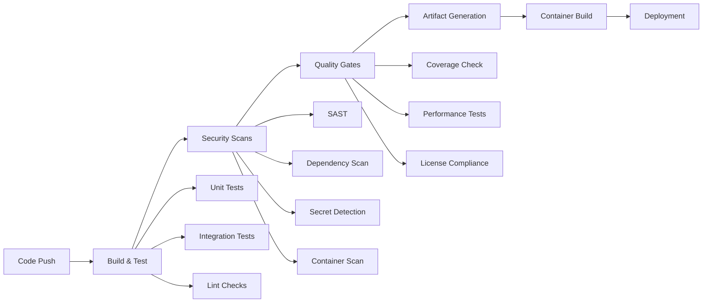

# CI/CD Policy & Quality Gates

## Overview

This document defines the Continuous Integration and Continuous Deployment (CI/CD) policy for AgentFlow, including quality gates, security requirements, and operational procedures. All code changes must pass through these automated checks before being merged or deployed.

## Policy Objectives

- **Security First**: Prevent vulnerable code from reaching production
- **Quality Assurance**: Maintain high code quality standards
- **Reliability**: Ensure consistent and reproducible builds
- **Compliance**: Meet regulatory and audit requirements
- **Developer Productivity**: Provide fast feedback while maintaining rigor

## CI/CD Pipeline Architecture

### Pipeline Stages



### Workflow Triggers

| Trigger | Workflows | Purpose |
|---------|-----------|---------|
| Push to `main` | CI, Security, Release | Full validation and deployment |
| Push to `develop` | CI, Security | Development validation |
| Pull Request | CI, Security | Change validation |
| Schedule (Daily) | Security Scan | Continuous monitoring |
| Manual Dispatch | All | On-demand execution |
| Tag Push (`v*`) | Release | Production deployment |

## Quality Gates

### Gate 1: Build & Test
**Requirement**: All builds must succeed and tests must pass

- **Build Success**: All Go modules compile successfully
- **Test Coverage**: Minimum 80% code coverage
- **Test Success**: All unit and integration tests pass
- **Cross-Platform**: Builds succeed on Linux, Windows, macOS
- **Performance**: Build time < 10 minutes

**Failure Action**: Block merge, require fixes

### Gate 2: Code Quality
**Requirement**: Code must meet quality standards

- **Linting**: golangci-lint passes with zero issues
- **Formatting**: Code is properly formatted (gofmt)
- **Complexity**: Cyclomatic complexity within limits
- **Documentation**: Public APIs are documented
- **Best Practices**: Follows Go best practices

**Failure Action**: Block merge, require code improvements

### Gate 3: Security Scanning
**Requirement**: No High or Critical security vulnerabilities

#### Static Application Security Testing (SAST)
- **gosec**: No High/Critical Go security issues
- **CodeQL**: No security vulnerabilities detected
- **Semgrep**: Security patterns pass validation

#### Dependency Scanning
- **govulncheck**: No known vulnerabilities in dependencies
- **OSV Scanner**: No vulnerable packages detected
- **Nancy**: Sonatype vulnerability database clear

#### Secret Detection
- **gitleaks**: No secrets in code or git history
- **Manual Review**: Sensitive data patterns reviewed

#### Container Security
- **Trivy**: Container images have no High/Critical vulnerabilities
- **Grype**: Anchore security scan passes

**Failure Action**: Block merge, require security remediation

### Gate 4: License Compliance
**Requirement**: All dependencies have compatible licenses

- **FOSSA**: License compliance verified
- **Approved Licenses**: Only pre-approved licenses used
- **License Headers**: Source files have proper headers
- **Attribution**: Third-party licenses properly attributed

**Failure Action**: Block merge, require license review

### Gate 5: Supply Chain Security
**Requirement**: Artifacts are signed and traceable

- **SBOM Generation**: Software Bill of Materials created
- **Provenance**: Build provenance attestation
- **Signing**: Artifacts signed with Cosign
- **Verification**: Signatures can be verified

**Failure Action**: Block release, require signing fixes

## Security Requirements

### Vulnerability Severity Levels

| Severity | Action | Timeline |
|----------|--------|----------|
| Critical | Block immediately | Fix within 24 hours |
| High | Block merge | Fix within 7 days |
| Medium | Allow with tracking | Fix within 30 days |
| Low | Allow with tracking | Fix within 90 days |

### Security Scanning Tools

#### Required Tools
- **gosec**: Go security analyzer
- **gitleaks**: Secret detection
- **OSV Scanner**: Vulnerability database
- **Trivy**: Container and filesystem scanner
- **CodeQL**: Semantic code analysis

#### Optional Tools
- **Semgrep**: Additional SAST rules
- **Nancy**: Sonatype vulnerability scanner
- **Grype**: Anchore vulnerability scanner

### Secret Management
- **No Hardcoded Secrets**: All secrets via GitHub Secrets or external providers
- **Secret Rotation**: Regular rotation of all credentials
- **Least Privilege**: Minimal permissions for CI/CD accounts
- **Audit Logging**: All secret access logged

## Branch Protection Rules

### Main Branch (`main`)
- **Required Reviews**: 2 approvals from code owners
- **Status Checks**: All CI workflows must pass
- **Up-to-date**: Branch must be up-to-date with main
- **Admin Override**: Disabled (no exceptions)
- **Force Push**: Disabled
- **Deletion**: Disabled

### Develop Branch (`develop`)
- **Required Reviews**: 1 approval
- **Status Checks**: CI and Security workflows must pass
- **Up-to-date**: Required
- **Admin Override**: Enabled for hotfixes
- **Force Push**: Disabled
- **Deletion**: Disabled

### Feature Branches
- **Required Reviews**: 1 approval
- **Status Checks**: CI workflow must pass
- **Up-to-date**: Recommended
- **Admin Override**: Enabled
- **Force Push**: Allowed
- **Deletion**: Allowed after merge

## Artifact Management

### Build Artifacts
- **Retention**: 90 days for development, 2 years for releases
- **Signing**: All artifacts signed with Cosign
- **Storage**: GitHub Container Registry (GHCR)
- **Naming**: Semantic versioning for releases

### Container Images
- **Multi-Architecture**: amd64 and arm64 support
- **Base Images**: Minimal, security-hardened base images
- **Scanning**: All images scanned before push
- **Signing**: Keyless signing with Cosign
- **SBOM**: Software Bill of Materials attached

### Documentation
- **API Docs**: Generated from code comments
- **Architecture**: Decision records (ADRs) maintained
- **Runbooks**: Operational procedures documented
- **Security**: Security baseline documented

## Performance Requirements

### Build Performance
- **Build Time**: < 10 minutes for full pipeline
- **Test Time**: < 5 minutes for unit tests
- **Security Scan**: < 15 minutes for all scans
- **Container Build**: < 20 minutes for multi-arch

### Resource Limits
- **CPU**: 4 cores maximum per job
- **Memory**: 8GB maximum per job
- **Storage**: 50GB maximum per job
- **Timeout**: 60 minutes maximum per workflow

### Caching Strategy
- **Go Modules**: Cached between builds
- **Docker Layers**: Build cache enabled
- **Dependencies**: Package managers cached
- **Test Results**: Test cache when possible

## Monitoring & Alerting

### Success Metrics
- **Build Success Rate**: > 95%
- **Security Scan Pass Rate**: > 98%
- **Mean Time to Feedback**: < 10 minutes
- **Mean Time to Recovery**: < 2 hours

### Failure Handling
- **Immediate Notification**: Slack/email for failures
- **Escalation**: Auto-escalate after 2 hours
- **Rollback**: Automated rollback for critical failures
- **Post-Mortem**: Required for production incidents

### Audit Requirements
- **Build Logs**: Retained for 1 year
- **Security Scans**: Results archived
- **Access Logs**: CI/CD access tracked
- **Change Tracking**: All changes auditable

## Exception Process

### Emergency Hotfixes
1. **Approval**: Security team approval required
2. **Documentation**: Exception reason documented
3. **Timeline**: Temporary bypass < 24 hours
4. **Follow-up**: Full validation within 48 hours

### Security Exceptions
1. **Risk Assessment**: Security team evaluation
2. **Mitigation**: Compensating controls required
3. **Approval**: CISO approval for High/Critical
4. **Review**: Monthly exception review

### Process Exceptions
1. **Business Justification**: Clear business need
2. **Risk Mitigation**: Alternative controls
3. **Time Limit**: Maximum 30 days
4. **Documentation**: Exception tracking

## Compliance & Governance

### Regulatory Requirements
- **SOC 2**: Security controls documented
- **ISO 27001**: Information security management
- **GDPR**: Data protection compliance
- **HIPAA**: Healthcare data protection (if applicable)

### Audit Trail
- **Build History**: Complete build records
- **Change Tracking**: All code changes tracked
- **Access Logs**: User access to CI/CD systems
- **Security Events**: Security-related events logged

### Documentation Requirements
- **Policy Updates**: Quarterly review
- **Procedure Documentation**: Step-by-step guides
- **Training Materials**: Developer onboarding
- **Incident Response**: Security incident procedures

## Roles & Responsibilities

### Development Team
- **Code Quality**: Ensure code meets standards
- **Test Coverage**: Maintain adequate test coverage
- **Security**: Follow secure coding practices
- **Documentation**: Document code and changes

### Security Team
- **Policy Definition**: Define security requirements
- **Tool Configuration**: Configure security tools
- **Exception Review**: Approve security exceptions
- **Incident Response**: Handle security incidents

### DevOps Team
- **Pipeline Maintenance**: Maintain CI/CD infrastructure
- **Tool Updates**: Keep tools current
- **Performance Optimization**: Optimize build performance
- **Monitoring**: Monitor pipeline health

### Management
- **Resource Allocation**: Provide necessary resources
- **Policy Approval**: Approve policy changes
- **Risk Acceptance**: Accept residual risks
- **Compliance Oversight**: Ensure compliance

## Tool Configuration

### GitHub Actions Configuration
```yaml
# Required workflow permissions
permissions:
  contents: read
  security-events: write
  id-token: write
  packages: write
  attestations: write

# Required environment variables
env:
  GO_VERSION: '1.22'
  REGISTRY: ghcr.io
```

### Security Tool Thresholds
```yaml
# gosec configuration
gosec:
  severity: high
  confidence: medium
  exclude_rules: []

# OSV Scanner configuration
osv-scanner:
  fail-on: high
  format: sarif

# Trivy configuration
trivy:
  severity: HIGH,CRITICAL
  exit-code: 1
```

## Continuous Improvement

### Regular Reviews
- **Monthly**: Pipeline performance review
- **Quarterly**: Security tool effectiveness
- **Annually**: Complete policy review
- **Ad-hoc**: After security incidents

### Metrics Collection
- **Build Metrics**: Success rates, duration
- **Security Metrics**: Vulnerability detection
- **Quality Metrics**: Code coverage, defect rates
- **Performance Metrics**: Pipeline efficiency

### Tool Updates
- **Security Tools**: Monthly updates
- **Build Tools**: Quarterly updates
- **Dependencies**: Continuous monitoring
- **Base Images**: Monthly security updates

---

**Document Version**: 1.0  
**Last Updated**: 2024-01-01  
**Next Review**: 2024-04-01  
**Owner**: DevOps Team  
**Approver**: CTO