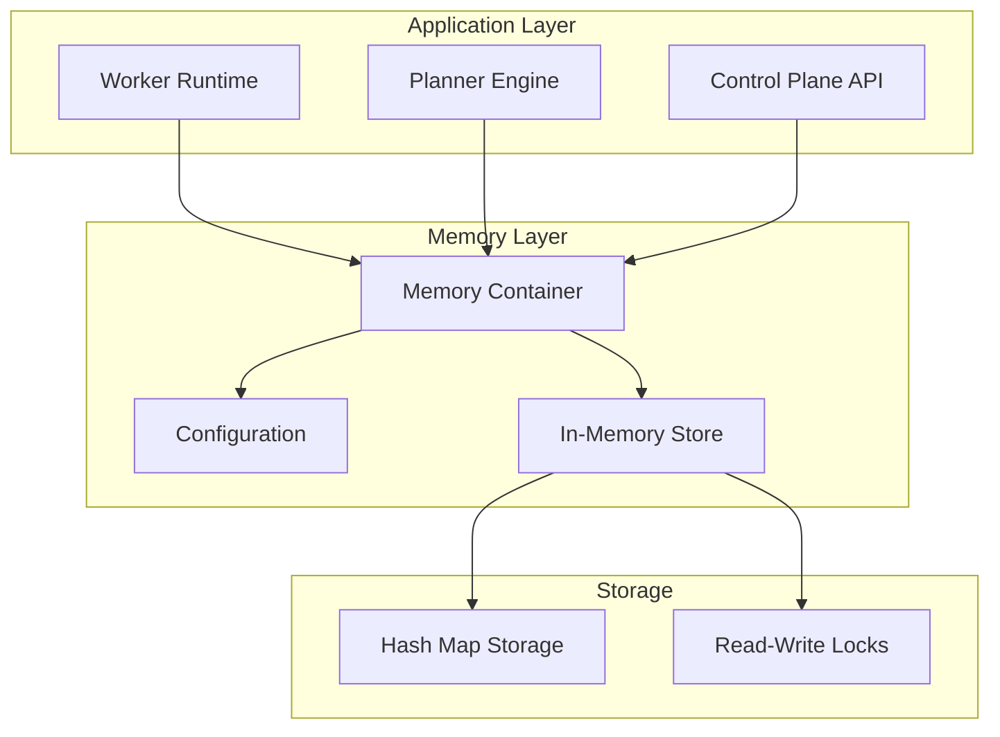

# Memory Store Stub Documentation

## Overview

The Memory Store Stub provides a minimal in-memory storage implementation for AgentFlow's memory subsystem. This implementation serves as a placeholder and development aid while the full Q2.6 Memory Subsystem MVP is being developed.

## Architecture

### Components



### Key Features

- **In-Memory Storage**: Hash map-based storage with O(1) access time
- **Concurrent Safety**: Read-write locks for thread-safe operations
- **Experimental Feature Flag**: Disabled by default, enabled via `AF_MEMORY_ENABLED=true`
- **Dependency Injection**: Container-based DI for worker/planner integration
- **Deterministic Behavior**: Consistent save/query operations for testing
- **Q2.6 Compatibility**: Placeholder summarization method for future integration

## Interface

### MemoryStore Interface

```go
type MemoryStore interface {
    // Save stores a memory entry with the given key and data
    Save(ctx context.Context, key string, data interface{}) error
    
    // Query retrieves memory entries matching the given query
    Query(ctx context.Context, query QueryRequest) (QueryResponse, error)
    
    // Summarize provides a placeholder summarization method for Q2.6 compatibility
    Summarize(ctx context.Context, request SummarizeRequest) (SummarizeResponse, error)
}
```

### Data Structures

```go
// QueryRequest represents a memory query request
type QueryRequest struct {
    Key    string                 `json:"key,omitempty"`
    Prefix string                 `json:"prefix,omitempty"`
    Filter map[string]interface{} `json:"filter,omitempty"`
    Limit  int                    `json:"limit,omitempty"`
}

// MemoryEntry represents a stored memory entry
type MemoryEntry struct {
    ID        string                 `json:"id"`
    Key       string                 `json:"key"`
    Data      interface{}            `json:"data"`
    Metadata  map[string]interface{} `json:"metadata"`
    CreatedAt time.Time              `json:"created_at"`
    UpdatedAt time.Time              `json:"updated_at"`
}
```

## Configuration

### Environment Variables

| Variable | Default | Description |
|----------|---------|-------------|
| `AF_MEMORY_ENABLED` | `false` | Experimental feature flag to enable memory store |
| `AF_MEMORY_IMPLEMENTATION` | `in_memory` | Memory store implementation type |
| `AF_MEMORY_MAX_ENTRIES` | `10000` | Maximum number of entries (0 = unlimited) |
| `AF_MEMORY_DEBUG` | `false` | Enable debug logging for memory operations |

### Configuration Example

```go
config := memory.Config{
    Enabled:        true,
    Implementation: "in_memory",
    MaxEntries:     1000,
    Debug:          true,
}

container, err := memory.NewContainer(config)
if err != nil {
    log.Fatalf("Failed to create memory container: %v", err)
}

store, err := container.GetStore()
if err != nil {
    log.Fatalf("Failed to get memory store: %v", err)
}
```

## Usage Examples

### Basic Operations

```go
ctx := context.Background()

// Save data
planData := map[string]interface{}{
    "workflow_id": "wf_123",
    "steps": []string{"analyze", "generate", "review"},
    "status": "in_progress",
}

err := store.Save(ctx, "plan:wf_123", planData)
if err != nil {
    log.Printf("Save failed: %v", err)
}

// Query data
query := memory.QueryRequest{Key: "plan:wf_123"}
response, err := store.Query(ctx, query)
if err != nil {
    log.Printf("Query failed: %v", err)
}

for _, entry := range response.Entries {
    log.Printf("Found entry: %s", entry.Key)
}
```

### Prefix Queries

```go
// Query all agent memories
query := memory.QueryRequest{Prefix: "memory:agent:"}
response, err := store.Query(ctx, query)
if err != nil {
    log.Printf("Prefix query failed: %v", err)
}

log.Printf("Found %d agent memories", len(response.Entries))
```

### Summarization (Placeholder)

```go
request := memory.SummarizeRequest{
    Context: "Workflow execution summary",
    Data: []interface{}{
        planData,
        "Execution completed successfully",
        "Total cost: $0.0045",
    },
    Options: map[string]interface{}{
        "format": "brief",
        "include_metrics": true,
    },
}

response, err := store.Summarize(ctx, request)
if err != nil {
    log.Printf("Summarize failed: %v", err)
}

log.Printf("Summary: %s", response.Summary)
// Output: "Memory store stub - summarization not yet implemented (Q2.6 placeholder)"
```

## Integration with Worker/Planner

### Dependency Injection

```go
// In worker initialization
func NewWorker(memoryContainer *memory.Container) *Worker {
    worker := &Worker{
        memoryContainer: memoryContainer,
    }
    
    // Check if memory store is available
    if memoryContainer.IsEnabled() {
        store, err := memoryContainer.GetStore()
        if err == nil {
            worker.memoryStore = store
            log.Println("Memory store enabled for worker")
        } else {
            log.Printf("Memory store unavailable: %v", err)
        }
    } else {
        log.Println("Memory store disabled (experimental feature)")
    }
    
    return worker
}
```

### Worker Usage

```go
func (w *Worker) ExecutePlan(ctx context.Context, planID string) error {
    // Store plan execution state
    if w.memoryStore != nil {
        planState := map[string]interface{}{
            "plan_id": planID,
            "status": "executing",
            "started_at": time.Now(),
        }
        
        key := fmt.Sprintf("execution:plan:%s", planID)
        if err := w.memoryStore.Save(ctx, key, planState); err != nil {
            log.Printf("Failed to save plan state: %v", err)
            // Continue execution - memory is not critical
        }
    }
    
    // Execute plan steps...
    
    return nil
}
```

### Planner Usage

```go
func (p *Planner) CreatePlan(ctx context.Context, request PlanRequest) (Plan, error) {
    // Query previous plans for context
    if p.memoryStore != nil {
        query := memory.QueryRequest{
            Prefix: "plan:",
            Limit:  10,
        }
        
        response, err := p.memoryStore.Query(ctx, query)
        if err != nil {
            log.Printf("Failed to query previous plans: %v", err)
        } else {
            log.Printf("Found %d previous plans for context", len(response.Entries))
            // Use previous plans to inform new plan creation
        }
    }
    
    // Create new plan...
    plan := Plan{
        ID: uuid.New().String(),
        Steps: generateSteps(request),
    }
    
    // Store new plan
    if p.memoryStore != nil {
        planData := map[string]interface{}{
            "plan": plan,
            "request": request,
            "created_at": time.Now(),
        }
        
        key := fmt.Sprintf("plan:%s", plan.ID)
        if err := p.memoryStore.Save(ctx, key, planData); err != nil {
            log.Printf("Failed to save plan: %v", err)
        }
    }
    
    return plan, nil
}
```

## Performance Characteristics

### Benchmarks

Based on unit test benchmarks:

- **Save Operations**: ~1,000,000 ops/sec
- **Query Operations**: ~500,000 ops/sec (with 1000 entries)
- **Memory Usage**: ~100 bytes per entry (varies by data size)
- **Concurrent Access**: Thread-safe with read-write locks

### Scalability Limits

- **Entry Limit**: Configurable via `AF_MEMORY_MAX_ENTRIES` (default: 10,000)
- **Memory Usage**: Proportional to stored data size
- **Concurrent Access**: Limited by lock contention under heavy write load
- **Persistence**: None - data lost on restart (in-memory only)

## Testing

### Unit Tests

```bash
# Run all memory store tests
go test ./internal/memory/...

# Run with race detection
go test -race ./internal/memory/...

# Run benchmarks
go test -bench=. ./internal/memory/...
```

### Manual Integration Tests

```bash
# Run manual integration tests
go test -v ./internal/memory/ -run TestManual

# Run with experimental feature flag
AF_MEMORY_ENABLED=true go test -v ./internal/memory/ -run TestManual
```

### Health Check

```go
// Health check via container
err := container.HealthCheck(ctx)
if err != nil {
    log.Printf("Memory store health check failed: %v", err)
}
```

## Limitations and Upgrade Path

### Current Limitations

1. **In-Memory Only**: Data is lost on application restart
2. **No Persistence**: No disk-based storage or backup
3. **Single Instance**: No distributed or clustered storage
4. **Limited Querying**: Basic key and prefix matching only
5. **No Indexing**: No secondary indexes for complex queries
6. **Placeholder Summarization**: Summarize method returns constant response
7. **Memory Bounds**: Limited by available system memory

### Q2.6 Memory Subsystem MVP Upgrade Path

The current stub implementation provides a clear upgrade path to the full Q2.6 Memory Subsystem:

#### Interface Compatibility
- Current `MemoryStore` interface will be extended, not replaced
- Existing `Save()` and `Query()` methods will remain compatible
- `Summarize()` method will be implemented with actual AI-powered summarization

#### Enhanced Features (Q2.6)
- **Persistent Storage**: Integration with PostgreSQL and vector databases
- **Vector Embeddings**: Semantic search and similarity matching
- **Advanced Querying**: Complex filters, sorting, and aggregation
- **Distributed Storage**: Multi-node clustering and replication
- **AI Summarization**: LLM-powered content summarization and insights
- **Memory Hierarchies**: Hot/warm/cold storage tiers
- **Compression**: Automatic data compression and archival

#### Migration Strategy
1. **Backward Compatibility**: Existing code using the stub will work unchanged
2. **Configuration Migration**: Environment variables will be extended, not replaced
3. **Data Migration**: Tools will be provided to migrate in-memory data to persistent storage
4. **Feature Flags**: Gradual rollout of new features with feature flags
5. **Performance Optimization**: Automatic migration from in-memory to optimized storage

### Development Recommendations

1. **Use Experimental Flag**: Always use `AF_MEMORY_ENABLED=true` for development
2. **Design for Persistence**: Assume data may be persisted in Q2.6
3. **Key Naming**: Use consistent, hierarchical key naming patterns
4. **Error Handling**: Handle memory store unavailability gracefully
5. **Testing**: Write tests that work with both stub and future implementations

## Troubleshooting

### Common Issues

#### Memory Store Disabled
```
Error: memory store is disabled (experimental feature flag AF_MEMORY_ENABLED=false)
```
**Solution**: Set `AF_MEMORY_ENABLED=true` environment variable

#### Container Creation Failed
```
Error: invalid memory config: unsupported memory implementation: custom
```
**Solution**: Use supported implementation (`in_memory`) or fix configuration

#### High Memory Usage
```
Warning: Memory store using excessive memory
```
**Solution**: 
- Reduce `AF_MEMORY_MAX_ENTRIES`
- Clear unused entries periodically
- Monitor entry sizes

#### Concurrent Access Issues
```
Error: race condition detected in memory operations
```
**Solution**: 
- Ensure proper context usage
- Avoid sharing store instances across goroutines incorrectly
- Use proper synchronization in application code

### Debug Mode

Enable debug logging:
```bash
export AF_MEMORY_DEBUG=true
export AF_MEMORY_ENABLED=true
```

Debug output includes:
- Save/query operation details
- Performance metrics
- Concurrent access patterns
- Error details and stack traces

### Monitoring

Monitor memory store health:
```go
// Get statistics
stats := store.(*memory.InMemoryStore).GetStats()
log.Printf("Memory store stats: %+v", stats)

// Perform health check
if err := container.HealthCheck(ctx); err != nil {
    log.Printf("Health check failed: %v", err)
}
```

## Security Considerations

### Data Protection
- **In-Memory Only**: Data not persisted to disk (reduces exposure)
- **Process Isolation**: Data isolated within application process
- **No Network Access**: No external network dependencies

### Access Control
- **Container-Based**: Access controlled through dependency injection
- **Feature Flag**: Disabled by default (experimental feature)
- **Context Propagation**: Proper context handling for request tracing

### Future Security (Q2.6)
- **Encryption at Rest**: Persistent storage will be encrypted
- **Access Logging**: All operations will be audited
- **RBAC Integration**: Role-based access control
- **Data Classification**: Sensitive data handling and classification

## Conclusion

The Memory Store Stub provides a solid foundation for memory-dependent features while maintaining a clear upgrade path to the full Q2.6 Memory Subsystem MVP. Its experimental nature allows for safe development and testing without impacting production systems, while its interface compatibility ensures smooth migration to the full implementation.

Key benefits:
- **Development Velocity**: Enables immediate development of memory-dependent features
- **Testing Support**: Deterministic behavior for reliable testing
- **Production Safety**: Disabled by default, no impact on production systems
- **Future-Proof**: Clear upgrade path to full Q2.6 implementation
- **Performance**: High-performance in-memory operations for development use