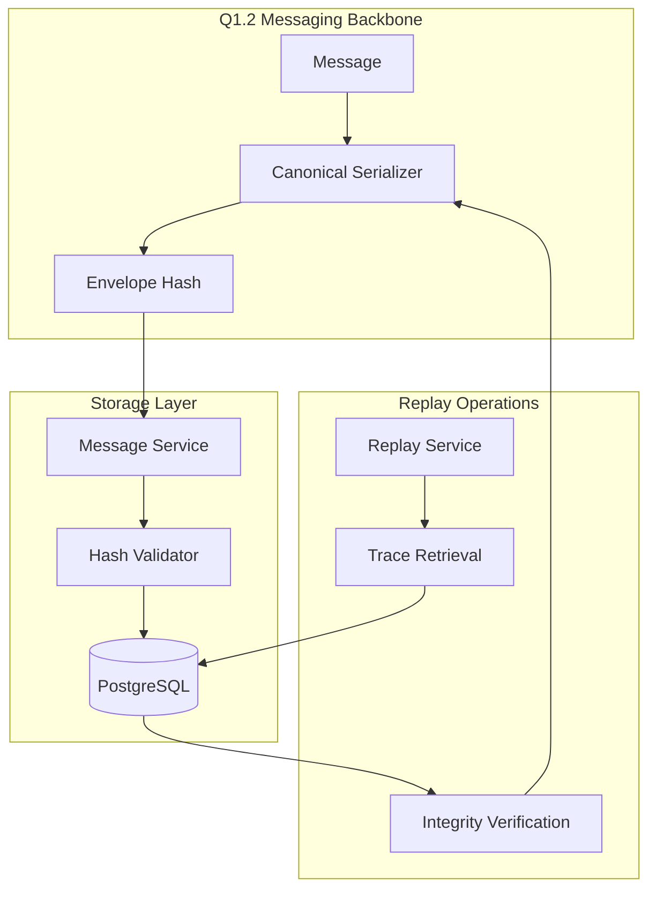

# Message Envelope Hash Integration with Q1.2 Messaging

## Overview

This document describes the integration of envelope hash persistence with the Q1.2 messaging backbone, providing message integrity validation and replay operation support for the AgentFlow platform.

## Architecture

The envelope hash integration consists of three main components:

1. **Q1.2 Canonical Serializer**: Provides deterministic message serialization and SHA256 hash computation
2. **Message Storage Service**: Validates and persists messages with envelope hash integrity checks
3. **Database Schema**: Stores envelope hashes alongside message content for integrity verification



## Envelope Hash Computation

### Canonical Serialization

The envelope hash is computed using the Q1.2 canonical serializer which ensures deterministic JSON serialization:

1. **Field Ordering**: All JSON fields are sorted alphabetically
2. **Type Consistency**: Values are canonicalized to ensure consistent representation
3. **Hash Exclusion**: The `envelope_hash` field itself is excluded from hash computation
4. **SHA256 Computation**: The canonical JSON is hashed using SHA256

```go
// Example: Computing envelope hash
serializer, err := messaging.NewCanonicalSerializer()
if err != nil {
    return fmt.Errorf("failed to create serializer: %w", err)
}

// Set envelope hash on message
err = serializer.SetEnvelopeHash(message)
if err != nil {
    return fmt.Errorf("failed to set envelope hash: %w", err)
}

// Validate existing hash
err = serializer.ValidateHash(message)
if err != nil {
    return fmt.Errorf("hash validation failed: %w", err)
}
```

### Hash Format

- **Algorithm**: SHA256
- **Encoding**: Hexadecimal string (64 characters)
- **Example**: `a1b2c3d4e5f6789012345678901234567890abcdef1234567890abcdef123456`

## Database Integration

### Schema Design

The `messages` table includes the `envelope_hash` column:

```sql
CREATE TABLE messages (
    id UUID PRIMARY KEY,
    tenant_id UUID NOT NULL REFERENCES tenants(id) ON DELETE CASCADE,
    trace_id VARCHAR(32),
    span_id VARCHAR(16),
    from_agent VARCHAR(255) NOT NULL,
    to_agent VARCHAR(255) NOT NULL,
    type VARCHAR(20) NOT NULL CHECK (type IN ('request', 'response', 'event', 'control')),
    payload JSONB NOT NULL DEFAULT '{}',
    metadata JSONB NOT NULL DEFAULT '{}',
    cost JSONB NOT NULL DEFAULT '{}',
    ts TIMESTAMP WITH TIME ZONE NOT NULL,
    envelope_hash VARCHAR(64) NOT NULL  -- SHA256 hex string
);
```

### Validation Rules

1. **Presence Validation**: `envelope_hash` must be present and non-empty
2. **Format Validation**: Must be a 64-character hexadecimal string
3. **Integrity Validation**: Hash must match recomputed hash of message content
4. **Insertion Validation**: Messages with invalid hashes are rejected

## Message Service Operations

### Creating Messages

```go
// Create message with envelope hash validation
func (s *Service) CreateMessage(ctx context.Context, msg *messaging.Message, tenantID uuid.UUID) error {
    // 1. Validate envelope_hash presence
    if msg.EnvelopeHash == "" {
        return fmt.Errorf("envelope_hash is required but missing")
    }

    // 2. Validate envelope hash integrity
    if err := s.serializer.ValidateHash(msg); err != nil {
        return fmt.Errorf("envelope hash validation failed: %w", err)
    }

    // 3. Store in database
    return s.storeMessage(ctx, msg, tenantID)
}
```

### Retrieving Messages

```go
// Retrieve message with integrity validation
func (s *Service) GetMessage(ctx context.Context, messageID, tenantID uuid.UUID) (*messaging.Message, error) {
    // 1. Retrieve from database
    dbMsg, err := s.queries.GetMessage(ctx, params)
    if err != nil {
        return nil, err
    }

    // 2. Convert to messaging format
    msg, err := s.dbMessageToMessage(&dbMsg)
    if err != nil {
        return nil, err
    }

    // 3. Validate envelope hash integrity
    if err := s.serializer.ValidateHash(msg); err != nil {
        return nil, fmt.Errorf("stored message envelope hash validation failed: %w", err)
    }

    return msg, nil
}
```

## Replay Operation Support

### Trace-Based Retrieval

The envelope hash enables secure replay operations by ensuring message authenticity:

```go
// Retrieve messages for replay with integrity validation
func (s *Service) ListMessagesByTrace(ctx context.Context, tenantID uuid.UUID, traceID string) ([]*messaging.Message, error) {
    // 1. Retrieve all messages for trace
    dbMessages, err := s.queries.ListMessagesByTrace(ctx, params)
    if err != nil {
        return nil, err
    }

    // 2. Convert and validate each message
    messages := make([]*messaging.Message, 0, len(dbMessages))
    for _, dbMsg := range dbMessages {
        msg, err := s.dbMessageToMessage(&dbMsg)
        if err != nil {
            return nil, err
        }

        // 3. Validate envelope hash for replay authenticity
        if err := s.serializer.ValidateHash(msg); err != nil {
            return nil, fmt.Errorf("message %s envelope hash validation failed during replay: %w", msg.ID, err)
        }

        messages = append(messages, msg)
    }

    return messages, nil
}
```

### Replay Integrity Guarantees

1. **Authenticity**: Envelope hash ensures messages haven't been tampered with
2. **Completeness**: All messages in a trace are validated before replay
3. **Ordering**: Messages are retrieved in chronological order by timestamp
4. **Failure Handling**: Any hash validation failure aborts the entire replay operation

## Security Considerations

### Tamper Detection

The envelope hash provides tamper-evident storage:

- **Content Modification**: Any change to message content invalidates the hash
- **Metadata Tampering**: Changes to metadata or cost information are detected
- **Database Tampering**: Direct database modifications are caught during retrieval
- **Replay Attacks**: Hash validation prevents injection of modified messages

### Attack Scenarios

1. **Message Injection**: Attacker cannot inject messages without valid envelope hash
2. **Content Modification**: Any tampering with stored messages is detected on retrieval
3. **Replay Manipulation**: Modified messages fail hash validation during replay
4. **Database Corruption**: Hash mismatches indicate data integrity issues

## Performance Considerations

### Hash Computation

- **Algorithm**: SHA256 is computationally efficient for message sizes
- **Caching**: Envelope hashes are computed once and stored
- **Validation**: Hash validation adds minimal overhead to message retrieval
- **Batch Operations**: Multiple messages can be validated concurrently

### Database Impact

- **Storage**: 64-byte overhead per message for hash storage
- **Indexing**: No additional indexes required for hash column
- **Queries**: Hash validation doesn't impact query performance
- **Backup**: Hashes are included in standard database backups

## Testing Procedures

### Unit Tests

The message service includes comprehensive unit tests:

```bash
# Run message service unit tests
go test -v ./internal/storage/message/
```

Test coverage includes:
- Message creation with valid envelope hash
- Rejection of messages with missing envelope hash
- Rejection of messages with invalid envelope hash
- Rejection of messages with tampered content
- Message retrieval with integrity validation
- Trace-based retrieval with replay validation
- Hash recomputation and verification

### Manual Testing

For manual verification of envelope hash integration:

1. **Database Setup**: Ensure PostgreSQL is running with AgentFlow schema
2. **Message Creation**: Create messages using Q1.2 canonical serializer
3. **Storage Verification**: Verify messages are stored with correct envelope hash
4. **Retrieval Testing**: Retrieve messages and verify hash integrity
5. **Replay Testing**: Test trace-based retrieval for replay operations

```go
// Manual test execution (requires database)
func ManualTestEnvelopeHashIntegration() {
    // Creates test messages, stores them, retrieves them,
    // and verifies envelope hash integrity throughout
}
```

### Integration Testing

Integration tests verify end-to-end functionality:

- Database connectivity and schema validation
- Q1.2 canonical serializer integration
- Message persistence and retrieval workflows
- Envelope hash computation consistency
- Replay operation integrity validation

## Troubleshooting

### Common Issues

1. **Hash Mismatch Errors**
   - **Cause**: Message content modified after hash computation
   - **Solution**: Recompute envelope hash after any message modifications

2. **Missing Envelope Hash**
   - **Cause**: Message created without calling `SetEnvelopeHash`
   - **Solution**: Always set envelope hash before storing messages

3. **Serialization Inconsistencies**
   - **Cause**: Different serialization methods producing different hashes
   - **Solution**: Use only the Q1.2 canonical serializer for hash computation

4. **Database Corruption**
   - **Cause**: Direct database modifications or storage issues
   - **Solution**: Restore from backup and verify all message hashes

### Diagnostic Commands

```bash
# Verify message service functionality
go test -v ./internal/storage/message/ -run TestService_

# Run manual integration test (requires database)
# The manual test is available in the test file itself
go test -v ./internal/storage/message/ -run ManualTestEnvelopeHashIntegration

# Validate database schema
goose -dir migrations postgres "connection_string" status
```

## Future Enhancements

### Planned Improvements

1. **Batch Validation**: Optimize hash validation for large message sets
2. **Hash Indexing**: Add database indexes for hash-based queries
3. **Compression**: Investigate hash compression for storage efficiency
4. **Monitoring**: Add metrics for hash validation performance and failures

### Compatibility

- **Q1.2 Integration**: Full compatibility with Q1.2 messaging backbone
- **Database Migrations**: Schema changes are handled through Goose migrations
- **Backward Compatibility**: Existing messages without hashes are handled gracefully
- **Cross-Platform**: Works consistently across Linux, Windows, and WSL2

## Conclusion

The envelope hash integration provides robust message integrity validation and replay operation support for the AgentFlow platform. By leveraging the Q1.2 canonical serializer and implementing comprehensive validation at the storage layer, the system ensures message authenticity and tamper detection throughout the message lifecycle.

The implementation follows security-first principles while maintaining high performance and compatibility with existing AgentFlow components. Regular testing and monitoring ensure continued reliability and integrity of the message storage system.