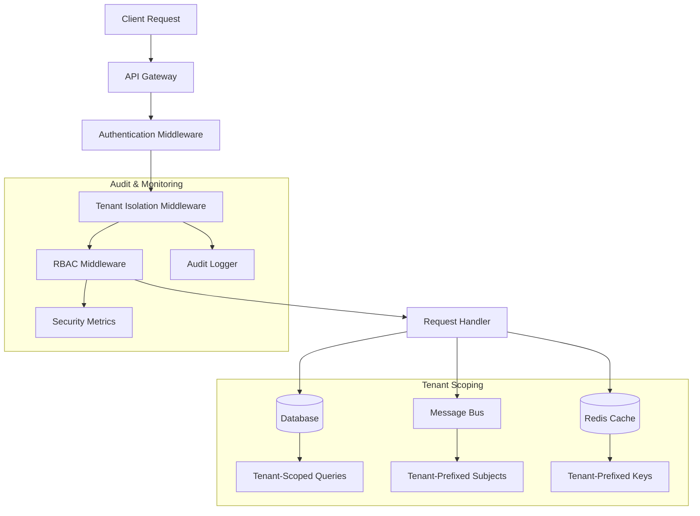
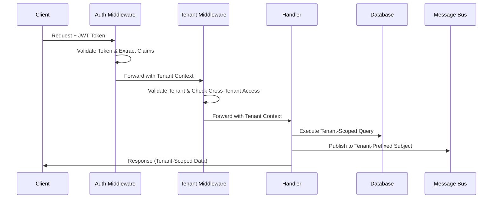

# Multi-Tenancy Architecture and Enforcement

## Overview

AgentFlow implements comprehensive multi-tenancy with strict tenant isolation at all system layers. The multi-tenancy system ensures that tenants cannot access each other's data, resources, or message streams, providing enterprise-grade security and compliance.

## Architecture

### Tenant Isolation Layers



### Multi-Tenant Data Flow



## Components

### 1. Tenant Context Management

**TenantContext Structure:**
```go
type TenantContext struct {
    TenantID       string                 `json:"tenant_id"`
    TenantName     string                 `json:"tenant_name"`
    Permissions    []string               `json:"permissions"`
    ResourceLimits map[string]interface{} `json:"resource_limits"`
}
```

**Context Propagation:**
- Tenant context is extracted from JWT claims during authentication
- Context is propagated through the entire request lifecycle
- All downstream operations use tenant context for scoping

### 2. Database Query Scoping

**Automatic Tenant Injection:**
```go
// Original Query
"SELECT * FROM workflows WHERE name = $1"

// Tenant-Scoped Query (Automatic)
"SELECT * FROM workflows WHERE workflows.tenant_id = $2 AND name = $1"
```

**Multi-Tenant Tables:**
- `users` - User accounts scoped by tenant
- `agents` - Agent definitions per tenant
- `workflows` - Workflow definitions per tenant
- `messages` - Message history per tenant
- `tools` - Tool registrations per tenant
- `audits` - Audit logs per tenant
- `budgets` - Budget management per tenant
- `rbac_roles` - Role definitions per tenant
- `rbac_bindings` - Role assignments per tenant

**Non-Tenant Tables:**
- `tenants` - Tenant master data
- `plans` - Scoped through workflow relationships

### 3. Message Bus Subject Isolation

**Subject Patterns:**
```
{tenant_id}.{category}.{resource}.{action}

Examples:
- tenant-123.workflows.workflow-456.in
- tenant-123.agents.agent-789.out
- tenant-123.tools.calls
- tenant-123.system.health
```

**Wildcard Subscriptions:**
```
{tenant_id}.workflows.*     # All workflow messages for tenant
{tenant_id}.agents.*        # All agent messages for tenant
{tenant_id}.*              # All messages for tenant (admin use)
```

### 4. Cross-Tenant Access Prevention

**Detection Points:**
- Query parameters: `?tenant_id=other-tenant`
- HTTP headers: `X-Tenant-ID: other-tenant`
- URL paths: `/api/v1/tenants/other-tenant/resources`
- Message subjects: `other-tenant.workflows.*.in`

**Prevention Mechanisms:**
- Request validation before processing
- Automatic query scoping injection
- Subject validation for message operations
- Audit logging for violation attempts

## Security Features

### 1. Tenant Validation

**Tenant Existence Check:**
```sql
SELECT id, name, tier, settings 
FROM tenants 
WHERE id = $1 AND active = true
```

**Resource Limits Enforcement:**
- Workflow count limits per tenant
- Agent count limits per tenant
- Message rate limits per tenant
- Storage quota limits per tenant

### 2. Cross-Tenant Access Auditing

**Audit Event Structure:**
```json
{
  "tenant_id": "tenant-123",
  "actor_type": "user",
  "actor_id": "user-456",
  "action": "cross_tenant_access_attempt",
  "resource_type": "security_violation",
  "details": {
    "attempt_type": "cross_tenant_access",
    "details": "query parameter tenant_id (tenant-456) does not match user tenant (tenant-123)",
    "user_id": "user-456",
    "roles": ["developer"],
    "timestamp": "2025-01-15T10:30:00Z"
  }
}
```

**Audit Triggers:**
- Cross-tenant query parameters
- Cross-tenant HTTP headers
- Cross-tenant URL paths
- Cross-tenant message subjects
- Tenant validation failures

### 3. Isolation Validation

**Database Isolation:**
- All queries automatically scoped by tenant_id
- Cross-tenant JOINs prevented
- Tenant-specific indexes for performance

**Message Bus Isolation:**
- Subject prefixes enforce tenant boundaries
- Consumer filtering by tenant prefix
- Replay operations scoped to tenant

**Cache Isolation:**
- Redis keys prefixed with tenant ID
- Tenant-specific cache namespaces
- Automatic cache invalidation per tenant

## Configuration

### Environment Variables

```bash
# Tenant isolation settings
AF_TENANT_ISOLATION_ENABLED=true
AF_TENANT_VALIDATION_STRICT=true
AF_CROSS_TENANT_AUDIT_ENABLED=true

# Database scoping
AF_DB_TENANT_SCOPING_ENABLED=true
AF_DB_TENANT_VALIDATION_STRICT=true

# Message bus isolation
AF_MSG_TENANT_SUBJECTS_ENABLED=true
AF_MSG_CROSS_TENANT_VALIDATION=true
```

### Feature Flags

```yaml
tenant_isolation:
  enabled: true
  strict_mode: true
  audit_violations: true
  
database_scoping:
  enabled: true
  auto_inject: true
  validate_existing: true
  
message_isolation:
  enabled: true
  subject_prefixes: true
  cross_tenant_validation: true
```

## API Integration

### Middleware Stack Order

```go
// Correct middleware order for tenant isolation
router.Use(
    RecoveryMiddleware(),           // 1. Panic recovery
    LoggingMiddleware(),            // 2. Request logging
    TracingMiddleware(),            // 3. Distributed tracing
    AuthenticationMiddleware(),     // 4. JWT validation
    TenantIsolationMiddleware(),    // 5. Tenant scoping
    RBACMiddleware(),              // 6. Permission checks
    RateLimitingMiddleware(),       // 7. Rate limiting
)
```

### Request Headers

**Required Headers:**
```http
Authorization: Bearer <jwt_token>
```

**Optional Headers:**
```http
X-Tenant-ID: <tenant_id>        # Must match JWT tenant claim
X-Request-ID: <correlation_id>   # For request tracing
```

**Response Headers:**
```http
X-Tenant-ID: <tenant_id>         # Confirms tenant scope
X-Rate-Limit-Tenant: <limits>    # Tenant-specific rate limits
```

## Usage Examples

### 1. Database Operations

```go
// Automatic tenant scoping
ctx := security.WithTenantContext(context.Background(), tenantCtx)
tsdb := storage.NewTenantScopedDB(db, logger)

// This query is automatically scoped to the tenant
rows, err := tsdb.QueryContext(ctx, 
    "SELECT * FROM workflows WHERE name = $1", 
    "customer-support")
```

### 2. Message Bus Operations

```go
// Tenant-aware subject building
builder := messaging.NewTenantSubjectBuilder()
ctx := security.WithTenantContext(context.Background(), tenantCtx)

// Build tenant-scoped subject
subject, err := builder.WorkflowInFromContext(ctx, "workflow-123")
// Result: "tenant-456.workflows.workflow-123.in"

// Publish message with tenant isolation
err = messageBus.Publish(ctx, subject, message)
```

### 3. HTTP API Usage

```bash
# Valid same-tenant request
curl -H "Authorization: Bearer <jwt>" \
     -H "X-Tenant-ID: tenant-123" \
     https://api.agentflow.com/api/v1/workflows

# Cross-tenant request (will be blocked)
curl -H "Authorization: Bearer <jwt_tenant_123>" \
     -H "X-Tenant-ID: tenant-456" \
     https://api.agentflow.com/api/v1/workflows
```

## Monitoring and Observability

### Metrics

**Tenant Isolation Metrics:**
```
agentflow_tenant_requests_total{tenant_id, status}
agentflow_cross_tenant_attempts_total{tenant_id, attempt_type}
agentflow_tenant_validation_duration_seconds{tenant_id}
agentflow_tenant_query_scoping_total{tenant_id, table}
```

**Database Scoping Metrics:**
```
agentflow_db_tenant_queries_total{tenant_id, table, operation}
agentflow_db_scoping_injection_total{tenant_id, success}
agentflow_db_cross_tenant_blocks_total{tenant_id, table}
```

**Message Bus Isolation Metrics:**
```
agentflow_msg_tenant_subjects_total{tenant_id, category}
agentflow_msg_cross_tenant_blocks_total{tenant_id, subject}
agentflow_msg_tenant_replay_total{tenant_id, workflow_id}
```

### Logging

**Structured Log Fields:**
```json
{
  "timestamp": "2025-01-15T10:30:00Z",
  "level": "WARN",
  "message": "Cross-tenant access attempt detected",
  "tenant_id": "tenant-123",
  "user_id": "user-456",
  "attempt_type": "cross_tenant_access",
  "details": "query parameter tenant_id mismatch",
  "path": "/api/v1/workflows",
  "method": "GET",
  "trace_id": "abc123",
  "span_id": "def456"
}
```

### Alerting

**Critical Alerts:**
- Cross-tenant access attempts > threshold
- Tenant validation failures > threshold
- Database scoping injection failures
- Message bus cross-tenant violations

**Warning Alerts:**
- High tenant isolation overhead
- Tenant context propagation failures
- Audit logging failures

## Troubleshooting

### Common Issues

**1. Tenant Context Missing**
```
Error: tenant ID not found in context
Solution: Ensure authentication middleware runs before tenant middleware
```

**2. Cross-Tenant Access Blocked**
```
Error: cross-tenant access denied
Solution: Verify JWT token contains correct tenant_id claim
```

**3. Database Query Scoping Failure**
```
Error: failed to inject tenant scoping
Solution: Check table has tenant_id column or is in non-tenant table list
```

**4. Message Subject Validation Failure**
```
Error: subject tenant mismatch
Solution: Use tenant-aware subject builders or validate subject format
```

### Debugging Commands

```bash
# Check tenant context in logs
grep "tenant_id" /var/log/agentflow/api.log

# Verify database query scoping
grep "tenant-scoped query" /var/log/agentflow/api.log

# Monitor cross-tenant attempts
grep "cross_tenant_access" /var/log/agentflow/audit.log

# Check message subject isolation
grep "tenant.*workflows" /var/log/agentflow/messaging.log
```

### Performance Tuning

**Database Optimization:**
- Ensure tenant_id indexes exist on all multi-tenant tables
- Use composite indexes: (tenant_id, frequently_queried_column)
- Monitor query performance with tenant scoping overhead

**Message Bus Optimization:**
- Use tenant-specific consumer groups
- Implement tenant-aware message routing
- Monitor subject prefix performance impact

**Cache Optimization:**
- Use tenant-prefixed cache keys
- Implement tenant-aware cache invalidation
- Monitor cache hit rates per tenant

## Security Considerations

### Threat Model

**Threats Mitigated:**
- Cross-tenant data access
- Tenant enumeration attacks
- Message bus eavesdropping
- Cache poisoning attacks
- Audit log tampering

**Security Controls:**
- Automatic tenant scoping injection
- Cross-tenant access detection and blocking
- Comprehensive audit logging
- Tenant validation at multiple layers
- Message subject validation

### Compliance

**Standards Supported:**
- SOC 2 Type II (tenant isolation)
- ISO 27001 (access controls)
- GDPR (data isolation)
- HIPAA (tenant segregation)

**Audit Requirements:**
- All cross-tenant attempts logged
- Tenant access patterns monitored
- Data isolation verified regularly
- Security controls tested continuously

## Future Enhancements

### Planned Features

1. **Dynamic Tenant Onboarding**
   - Automated tenant provisioning
   - Self-service tenant management
   - Tenant lifecycle automation

2. **Advanced Isolation**
   - Network-level tenant isolation
   - Compute resource isolation
   - Storage encryption per tenant

3. **Tenant Analytics**
   - Usage patterns per tenant
   - Performance metrics per tenant
   - Cost allocation per tenant

4. **Enhanced Security**
   - Tenant-specific encryption keys
   - Advanced threat detection
   - Behavioral anomaly detection

### Migration Path

**From Single-Tenant:**
1. Add tenant_id columns to existing tables
2. Implement tenant context middleware
3. Enable automatic query scoping
4. Migrate existing data with default tenant
5. Enable cross-tenant access prevention

**To Enhanced Multi-Tenancy:**
1. Implement tenant-specific encryption
2. Add network-level isolation
3. Enable advanced monitoring
4. Implement tenant analytics
5. Add self-service capabilities