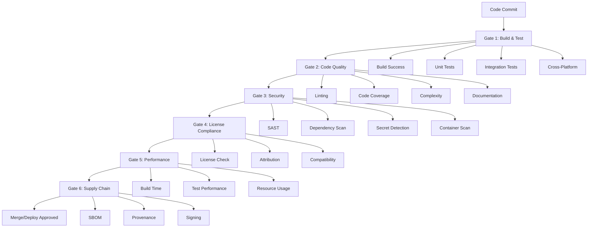

# Quality Gates & Gating Criteria

## Overview

Quality gates are automated checkpoints in the CI/CD pipeline that ensure code quality, security, and reliability standards are met before code can be merged or deployed. This document defines the specific criteria, thresholds, and procedures for each quality gate in the AgentFlow project.

## Gate Architecture

### Gate Hierarchy



## Gate 1: Build & Test

### Purpose
Ensure code compiles successfully and all tests pass across supported platforms.

### Criteria

#### Build Success
- **Requirement**: All Go modules must compile without errors
- **Platforms**: Linux (amd64, arm64), Windows (amd64), macOS (amd64, arm64)
- **Timeout**: 10 minutes maximum
- **Failure Action**: Block merge immediately

```bash
# Build validation commands
make build-all
task build-all
go build ./...
```

#### Unit Tests
- **Coverage Threshold**: 80% minimum
- **Success Rate**: 100% (all tests must pass)
- **Timeout**: 5 minutes maximum
- **Parallel Execution**: Enabled with race detection

```bash
# Test validation commands
go test -race -coverprofile=coverage.out ./...
go tool cover -func=coverage.out
```

#### Integration Tests
- **Success Rate**: 100% (all tests must pass)
- **Timeout**: 15 minutes maximum
- **Environment**: Isolated test environment
- **Data**: Test data cleanup required

#### Cross-Platform Validation
- **Matrix Testing**: All supported OS/architecture combinations
- **Path Handling**: Windows path compatibility verified
- **Binary Compatibility**: Executables run on target platforms

### Gate 1 Configuration

```yaml
# GitHub Actions configuration
strategy:
  matrix:
    os: [ubuntu-latest, windows-latest, macos-latest]
    go-version: ['1.22']
    
steps:
  - name: Build
    run: go build -v ./...
    
  - name: Test
    run: go test -race -coverprofile=coverage.out ./...
    
  - name: Coverage Check
    run: |
      coverage=$(go tool cover -func=coverage.out | grep total | awk '{print $3}' | sed 's/%//')
      if (( $(echo "$coverage < 80" | bc -l) )); then
        echo "Coverage $coverage% is below 80% threshold"
        exit 1
      fi
```

## Gate 2: Code Quality

### Purpose
Maintain consistent code quality and adherence to best practices.

### Criteria

#### Linting
- **Tool**: golangci-lint
- **Configuration**: `.golangci.yml`
- **Severity**: All issues must be resolved
- **Timeout**: 5 minutes maximum

```yaml
# .golangci.yml configuration
linters:
  enable:
    - gofmt
    - goimports
    - govet
    - ineffassign
    - misspell
    - staticcheck
    - unused
    - gosec
    - errcheck
    - gocritic
    
issues:
  max-issues-per-linter: 0
  max-same-issues: 0
```

#### Code Coverage
- **Minimum Coverage**: 80% overall
- **Critical Path Coverage**: 95% for core functionality
- **New Code Coverage**: 90% for new additions
- **Coverage Report**: Generated and uploaded

#### Cyclomatic Complexity
- **Maximum Complexity**: 15 per function
- **Tool**: gocyclo
- **Exceptions**: Documented and approved
- **Refactoring**: Required for violations

#### Documentation
- **Public API**: 100% documented
- **Examples**: Provided for complex functions
- **README**: Up-to-date and comprehensive
- **Godoc**: Generates without warnings

### Gate 2 Configuration

```yaml
- name: Lint
  uses: golangci/golangci-lint-action@v4
  with:
    version: latest
    args: --timeout=5m
    
- name: Check Documentation
  run: |
    go doc -all ./... > /dev/null
    if [ $? -ne 0 ]; then
      echo "Documentation generation failed"
      exit 1
    fi
```

## Gate 3: Security

### Purpose
Prevent security vulnerabilities from entering the codebase.

### Criteria

#### Static Application Security Testing (SAST)
- **Tools**: gosec, CodeQL, Semgrep
- **Severity Threshold**: No High or Critical issues
- **False Positives**: Documented exceptions only
- **SARIF Upload**: Results uploaded to GitHub Security

```yaml
# Security scanning configuration
- name: Run gosec
  uses: securecodewarrior/github-action-gosec@master
  with:
    args: '-fmt sarif -out gosec.sarif -severity high ./...'
    
- name: Upload SARIF
  uses: github/codeql-action/upload-sarif@v3
  with:
    sarif_file: gosec.sarif
```

#### Dependency Vulnerability Scanning
- **Tools**: govulncheck, OSV Scanner, Nancy
- **Database**: Latest vulnerability databases
- **Severity Threshold**: No High or Critical vulnerabilities
- **Update Policy**: Dependencies updated within SLA

```yaml
- name: Vulnerability Check
  run: |
    go install golang.org/x/vuln/cmd/govulncheck@latest
    govulncheck ./...
    
- name: OSV Scanner
  uses: google/osv-scanner-action@v1
  with:
    scan-args: |-
      -r
      --skip-git
      .
```

#### Secret Detection
- **Tool**: gitleaks
- **Scope**: Full git history
- **Patterns**: Comprehensive secret patterns
- **Exceptions**: None allowed

```yaml
- name: Secret Scan
  uses: gitleaks/gitleaks-action@v2
  env:
    GITHUB_TOKEN: ${{ secrets.GITHUB_TOKEN }}
```

#### Container Security
- **Tools**: Trivy, Grype
- **Base Images**: Security-hardened only
- **Vulnerability Threshold**: No High or Critical
- **Regular Updates**: Monthly base image updates

### Security Thresholds

| Tool | Severity | Action | SLA |
|------|----------|--------|-----|
| gosec | High/Critical | Block | Immediate |
| govulncheck | High/Critical | Block | 7 days |
| OSV Scanner | High/Critical | Block | 7 days |
| Trivy | High/Critical | Block | 30 days |
| gitleaks | Any | Block | Immediate |

## Gate 4: License Compliance

### Purpose
Ensure all dependencies have compatible licenses and proper attribution.

### Criteria

#### License Compatibility
- **Approved Licenses**: MIT, Apache 2.0, BSD, ISC
- **Restricted Licenses**: GPL, AGPL (requires approval)
- **Prohibited Licenses**: Proprietary, unknown
- **Tool**: FOSSA

#### Attribution Requirements
- **License Files**: All third-party licenses included
- **Copyright Notices**: Proper attribution maintained
- **NOTICE File**: Generated automatically
- **Documentation**: License information in README

#### Compliance Verification
- **Automated Scanning**: Every build
- **Manual Review**: New dependencies
- **Legal Review**: Restricted licenses
- **Audit Trail**: License decisions documented

### Gate 4 Configuration

```yaml
- name: License Check
  uses: fossa-contrib/fossa-action@v3
  with:
    api-key: ${{ secrets.FOSSA_API_KEY }}
    run-tests: true
```

## Gate 5: Performance

### Purpose
Ensure builds and tests complete within acceptable time limits.

### Criteria

#### Build Performance
- **Build Time**: < 10 minutes total
- **Parallel Jobs**: Optimized for concurrency
- **Caching**: Aggressive caching enabled
- **Resource Usage**: Within allocated limits

#### Test Performance
- **Unit Tests**: < 5 minutes
- **Integration Tests**: < 15 minutes
- **End-to-End Tests**: < 30 minutes
- **Performance Tests**: Baseline maintained

#### Resource Limits
- **CPU**: 4 cores maximum per job
- **Memory**: 8GB maximum per job
- **Storage**: 50GB maximum per job
- **Network**: Reasonable bandwidth usage

### Performance Monitoring

```yaml
- name: Performance Check
  run: |
    start_time=$(date +%s)
    make build
    end_time=$(date +%s)
    duration=$((end_time - start_time))
    
    if [ $duration -gt 600 ]; then
      echo "Build took ${duration}s, exceeding 10 minute limit"
      exit 1
    fi
```

## Gate 6: Supply Chain Security

### Purpose
Ensure build artifacts are traceable and verifiable.

### Criteria

#### Software Bill of Materials (SBOM)
- **Format**: SPDX and CycloneDX
- **Completeness**: All dependencies included
- **Accuracy**: Version information correct
- **Attachment**: SBOM attached to releases

#### Build Provenance
- **Attestation**: SLSA Level 2 minimum
- **Traceability**: Build environment documented
- **Reproducibility**: Builds are reproducible
- **Verification**: Provenance can be verified

#### Artifact Signing
- **Tool**: Cosign keyless signing
- **Coverage**: All release artifacts
- **Verification**: Signatures verifiable
- **Transparency**: Rekor transparency log

### Gate 6 Configuration

```yaml
- name: Generate SBOM
  run: |
    syft packages . -o spdx-json=sbom.spdx.json
    syft packages . -o cyclonedx-json=sbom.cyclonedx.json
    
- name: Sign Artifacts
  run: |
    cosign sign --yes ${{ env.REGISTRY }}/${{ env.IMAGE_NAME }}@${{ steps.build.outputs.digest }}
    
- name: Generate Attestation
  uses: actions/attest-build-provenance@v1
  with:
    subject-name: ${{ env.REGISTRY }}/${{ env.IMAGE_NAME }}
    subject-digest: ${{ steps.build.outputs.digest }}
```

## Gate Bypass Procedures

### Emergency Bypass
- **Approval**: Security team + CTO approval required
- **Documentation**: Incident ticket with justification
- **Timeline**: Maximum 24 hours
- **Follow-up**: Full validation within 48 hours

### Planned Exceptions
- **Process**: Exception request with risk assessment
- **Approval**: Security team approval
- **Mitigation**: Compensating controls required
- **Review**: Monthly exception review

### Hotfix Process
- **Trigger**: Critical production issue
- **Approval**: On-call engineer + manager
- **Validation**: Reduced gate set (security + basic tests)
- **Follow-up**: Full validation post-deployment

## Monitoring & Alerting

### Gate Success Metrics
- **Overall Pass Rate**: > 95%
- **Gate 1 (Build)**: > 98%
- **Gate 2 (Quality)**: > 95%
- **Gate 3 (Security)**: > 98%
- **Gate 4 (License)**: > 99%
- **Gate 5 (Performance)**: > 95%
- **Gate 6 (Supply Chain)**: > 99%

### Failure Analysis
- **Root Cause**: Automated failure categorization
- **Trends**: Weekly failure trend analysis
- **Improvements**: Monthly gate optimization review
- **Training**: Developer education on common failures

### Alerting Configuration
- **Immediate**: Critical security failures
- **Hourly**: Build failures
- **Daily**: Quality gate summary
- **Weekly**: Performance trends

## Gate Maintenance

### Regular Updates
- **Security Tools**: Monthly updates
- **Thresholds**: Quarterly review
- **Criteria**: Annual policy review
- **Documentation**: Continuous updates

### Tool Configuration
- **Version Pinning**: Tools pinned to specific versions
- **Configuration Management**: Centralized configuration
- **Testing**: Gate changes tested in staging
- **Rollback**: Quick rollback procedures

### Performance Optimization
- **Caching**: Optimize cache strategies
- **Parallelization**: Maximize parallel execution
- **Resource Allocation**: Right-size resources
- **Tool Selection**: Evaluate faster alternatives

---

**Document Version**: 1.0  
**Last Updated**: 2024-01-01  
**Next Review**: 2024-04-01  
**Owner**: DevOps Team  
**Approver**: Engineering Manager