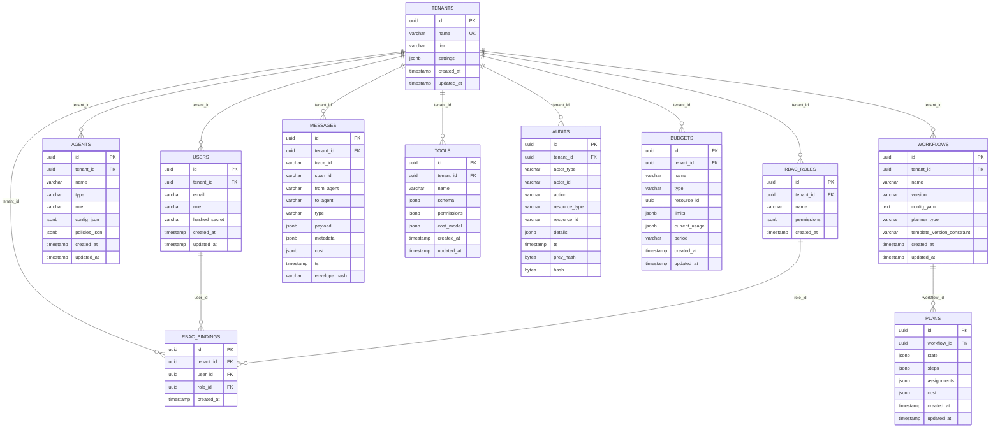

# AgentFlow Database Schema - Entity Relationship Diagram

This document describes the AgentFlow database schema, showing table relationships and multi-tenant isolation patterns.

## Schema Overview

The AgentFlow database schema is designed with multi-tenant isolation as a core principle. All data is scoped by `tenant_id` to ensure complete isolation between tenants while maintaining referential integrity and performance.

## Entity Relationship Diagram



## Multi-Tenant Isolation Patterns

### 1. Tenant Root Entity

**Table**: `tenants`
- **Purpose**: Root entity for multi-tenant hierarchy
- **Key Fields**: `id` (UUID), `name` (unique), `tier`, `settings`
- **Isolation**: Self-contained, no tenant_id column needed

### 2. Tenant-Scoped Entities

All other tables include `tenant_id UUID NOT NULL REFERENCES tenants(id) ON DELETE CASCADE`:

- **users**: User accounts scoped to tenant
- **agents**: AI agents and their configurations
- **workflows**: Workflow definitions and templates
- **messages**: Message history and communication logs
- **tools**: Available tools and their schemas
- **audits**: Audit trail for compliance and security
- **budgets**: Cost management and limits
- **rbac_roles**: Role definitions for access control
- **rbac_bindings**: User-role assignments

### 3. Cascade Delete Behavior

```sql
-- When a tenant is deleted, all related data is automatically removed
DELETE FROM tenants WHERE id = 'tenant-uuid';
-- This cascades to delete all:
-- - users, agents, workflows, messages, tools, audits, budgets, rbac_roles, rbac_bindings
```

## Table Relationships

### Core Entity Relationships

1. **Tenants → Users** (1:N)
   - Each tenant can have multiple users
   - Users are unique per tenant by email
   - Constraint: `UNIQUE(tenant_id, email)`

2. **Tenants → Agents** (1:N)
   - Each tenant can have multiple agents
   - Agents are unique per tenant by name
   - Constraint: `UNIQUE(tenant_id, name)`

3. **Tenants → Workflows** (1:N)
   - Each tenant can have multiple workflows
   - Workflows are unique per tenant by name+version
   - Constraint: `UNIQUE(tenant_id, name, version)`

4. **Workflows → Plans** (1:N)
   - Each workflow can have multiple execution plans
   - Plans inherit tenant context from workflow
   - No direct tenant_id on plans (derived through workflow)

### Communication Relationships

5. **Tenants → Messages** (1:N)
   - All messages are scoped to a tenant
   - Messages reference agents by name (not FK)
   - Supports cross-agent communication within tenant

### Security & Compliance Relationships

6. **Tenants → Audits** (1:N)
   - All actions are audited per tenant
   - Hash-chain integrity for tamper detection
   - Chronological ordering by timestamp

7. **Tenants → RBAC System** (1:N:N)
   - Each tenant has its own roles and permissions
   - Users can have multiple roles within a tenant
   - Constraint: `UNIQUE(tenant_id, user_id, role_id)`

### Resource Management Relationships

8. **Tenants → Tools** (1:N)
   - Tools are scoped per tenant
   - Each tenant can customize tool permissions
   - Constraint: `UNIQUE(tenant_id, name)`

9. **Tenants → Budgets** (1:N)
   - Budget limits per tenant
   - Can be scoped to workflows, users, or global
   - Constraint: `UNIQUE(tenant_id, name)`

## Index Strategy

### Multi-Tenant Isolation Indexes

```sql
-- Critical for tenant data isolation and performance
CREATE INDEX idx_users_tenant_id ON users(tenant_id);
CREATE INDEX idx_agents_tenant_id ON agents(tenant_id);
CREATE INDEX idx_workflows_tenant_id ON workflows(tenant_id);
CREATE INDEX idx_messages_tenant_id ON messages(tenant_id);
CREATE INDEX idx_tools_tenant_id ON tools(tenant_id);
CREATE INDEX idx_audits_tenant_id ON audits(tenant_id);
CREATE INDEX idx_budgets_tenant_id ON budgets(tenant_id);
CREATE INDEX idx_rbac_roles_tenant_id ON rbac_roles(tenant_id);
CREATE INDEX idx_rbac_bindings_tenant_id ON rbac_bindings(tenant_id);
```

### Query Performance Indexes

```sql
-- Optimized for common query patterns
CREATE INDEX idx_messages_trace_id ON messages(trace_id);
CREATE INDEX idx_messages_ts ON messages(ts);
CREATE INDEX idx_audits_ts ON audits(ts);
CREATE INDEX idx_audits_actor ON audits(tenant_id, actor_type, actor_id);
CREATE INDEX idx_workflows_planner_type ON workflows(tenant_id, planner_type);
CREATE INDEX idx_budgets_type_resource ON budgets(tenant_id, type, resource_id);
CREATE INDEX idx_rbac_bindings_user ON rbac_bindings(tenant_id, user_id);
```

### JSONB GIN Indexes

```sql
-- Flexible querying of JSON data
CREATE INDEX idx_plans_state_gin ON plans USING GIN(state);
CREATE INDEX idx_agents_config_gin ON agents USING GIN(config_json);
CREATE INDEX idx_agents_policies_gin ON agents USING GIN(policies_json);
CREATE INDEX idx_messages_payload_gin ON messages USING GIN(payload);
CREATE INDEX idx_messages_metadata_gin ON messages USING GIN(metadata);
CREATE INDEX idx_tools_schema_gin ON tools USING GIN(schema);
CREATE INDEX idx_tools_permissions_gin ON tools USING GIN(permissions);
CREATE INDEX idx_audits_details_gin ON audits USING GIN(details);
CREATE INDEX idx_budgets_limits_gin ON budgets USING GIN(limits);
CREATE INDEX idx_budgets_usage_gin ON budgets USING GIN(current_usage);
CREATE INDEX idx_rbac_roles_permissions_gin ON rbac_roles USING GIN(permissions);
```

## Data Types and Constraints

### UUID Primary Keys

All tables use UUID primary keys for:
- Global uniqueness across distributed systems
- Security (non-sequential, non-guessable)
- Compatibility with microservices architecture

### JSONB for Flexible Data

Strategic use of JSONB for:
- **Agent Configurations**: Flexible agent parameters
- **Workflow State**: Dynamic execution state
- **Message Payloads**: Varied message content
- **Tool Schemas**: Dynamic tool definitions
- **Audit Details**: Flexible audit information
- **Budget Limits**: Various limit types and currencies
- **RBAC Permissions**: Flexible permission structures

### Timestamp Handling

- **created_at**: Immutable creation timestamp
- **updated_at**: Automatically updated on record changes
- **ts**: Business timestamp for messages and audits
- All timestamps use `TIMESTAMP WITH TIME ZONE` for global compatibility

### Multi-Tenant Constraints

```sql
-- Tenant-scoped uniqueness
UNIQUE(tenant_id, email)        -- users
UNIQUE(tenant_id, name)         -- agents, tools, budgets, rbac_roles
UNIQUE(tenant_id, name, version) -- workflows
UNIQUE(tenant_id, user_id, role_id) -- rbac_bindings
```

## Security Considerations

### 1. Tenant Isolation

- All queries MUST include tenant_id in WHERE clauses
- Application layer enforces tenant context
- Database constraints prevent cross-tenant data access

### 2. Audit Trail Integrity

- Hash-chain prevents audit log tampering
- Chronological ordering ensures timeline integrity
- Immutable audit records (no UPDATE/DELETE)

### 3. Access Control

- RBAC system provides fine-grained permissions
- Role-based access scoped per tenant
- User-role bindings enforce authorization

### 4. Data Retention

- Cascade deletes ensure clean tenant removal
- Audit logs preserved for compliance requirements
- Message history retained per tenant policies

## Performance Characteristics

### Query Patterns

1. **Tenant-Scoped Queries** (Most Common)
   ```sql
   SELECT * FROM users WHERE tenant_id = $1;
   SELECT * FROM agents WHERE tenant_id = $1 AND type = $2;
   ```

2. **Cross-Entity Joins** (Within Tenant)
   ```sql
   SELECT u.email, r.name 
   FROM users u 
   JOIN rbac_bindings rb ON u.id = rb.user_id 
   JOIN rbac_roles r ON rb.role_id = r.id 
   WHERE u.tenant_id = $1;
   ```

3. **Time-Series Queries** (Messages, Audits)
   ```sql
   SELECT * FROM messages 
   WHERE tenant_id = $1 AND ts BETWEEN $2 AND $3 
   ORDER BY ts DESC;
   ```

4. **JSONB Queries** (Flexible Search)
   ```sql
   SELECT * FROM agents 
   WHERE tenant_id = $1 AND config_json @> '{"model": "gpt-4"}';
   ```

### Scalability Considerations

- **Horizontal Partitioning**: Can partition by tenant_id for large deployments
- **Read Replicas**: Read-heavy workloads can use replicas
- **Connection Pooling**: Essential for multi-tenant applications
- **Index Maintenance**: Regular VACUUM and REINDEX for JSONB columns

This schema design provides a solid foundation for AgentFlow's multi-tenant architecture while maintaining performance, security, and scalability requirements.