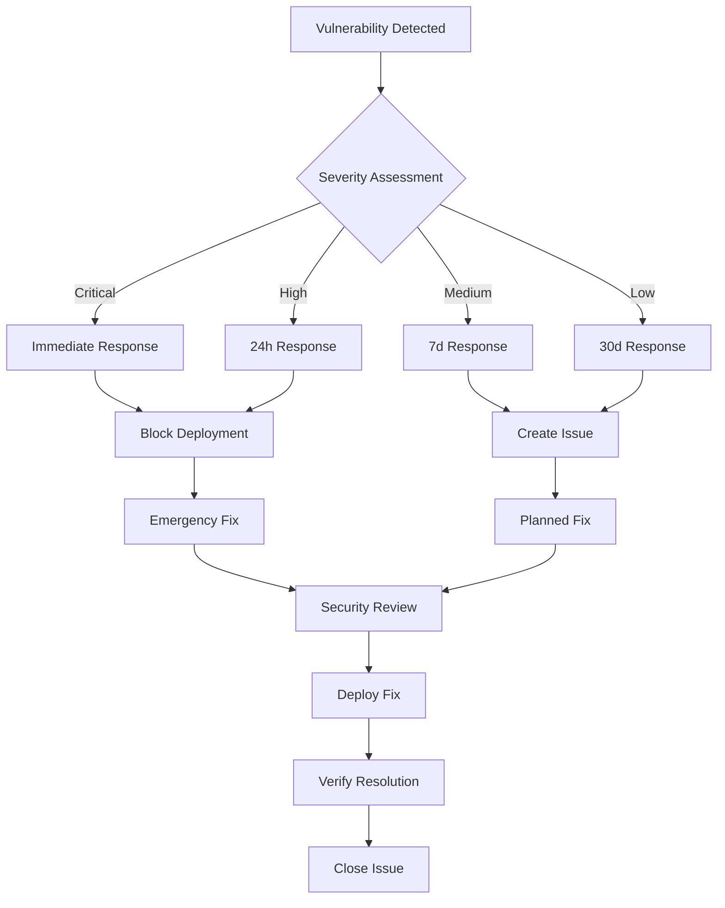
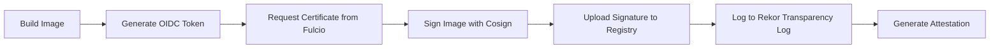
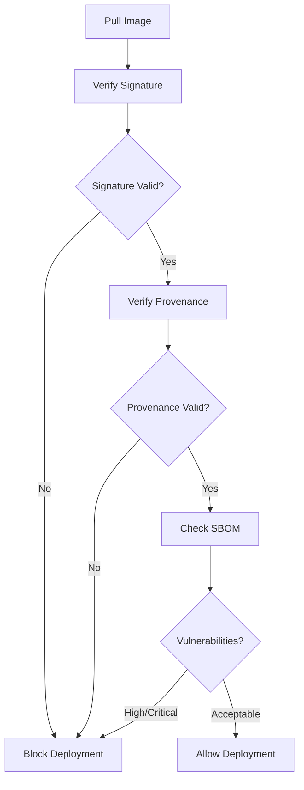

# Security Baseline & Exception Process

## Overview

This document establishes the security baseline for the AgentFlow project, defining security standards, tooling requirements, vulnerability management processes, and exception handling procedures. The security baseline ensures consistent security practices across all development phases and provides clear guidelines for maintaining security posture.

## Security Standards

### Severity Classification

AgentFlow uses a standardized severity classification system aligned with industry standards:

| Severity | Description | Response Time | Action Required |
|----------|-------------|---------------|-----------------|
| **Critical** | Vulnerabilities that can be exploited remotely with no authentication, leading to complete system compromise | Immediate (< 4 hours) | Block deployment, immediate fix required |
| **High** | Vulnerabilities that can lead to significant data exposure or system compromise with minimal user interaction | 24 hours | Block deployment, fix required before merge |
| **Medium** | Vulnerabilities that require user interaction or have limited impact scope | 7 days | Fix required, may be temporarily accepted with mitigation |
| **Low** | Vulnerabilities with minimal security impact or requiring significant user interaction | 30 days | Fix recommended, acceptable with documentation |
| **Info** | Security-related findings that don't represent immediate vulnerabilities | 90 days | Documentation and awareness, no blocking |

### Security Tools & Thresholds

#### Static Application Security Testing (SAST)

**Tool**: gosec  
**Threshold**: High/Critical findings block deployment  
**Configuration**: `.gosec.json` with project-specific rules  
**Scope**: All Go source code, excluding test files and generated code  

```json
{
  "severity": "medium",
  "confidence": "medium",
  "exclude": {
    "G101": false,
    "G102": false,
    "G103": false
  },
  "exclude-dirs": ["vendor", "node_modules", ".git"],
  "exclude-files": ["*_test.go", "*.pb.go"]
}
```

#### Dependency Vulnerability Scanning

**Tools**: govulncheck, OSV Scanner  
**Threshold**: High/Critical vulnerabilities block deployment  
**Database**: Latest vulnerability databases (updated daily)  
**Scope**: All direct and transitive dependencies  

**Update Policy**:
- Critical vulnerabilities: Update within 24 hours
- High vulnerabilities: Update within 7 days
- Medium vulnerabilities: Update within 30 days
- Low vulnerabilities: Update within 90 days

#### Secret Detection

**Tool**: gitleaks  
**Threshold**: Any secrets found block deployment  
**Configuration**: `.gitleaks.toml` with custom patterns  
**Scope**: Full git history and working directory  

**Patterns Detected**:
- API keys and tokens
- Database credentials
- Private keys and certificates
- Cloud provider credentials
- JWT secrets
- Custom application secrets

#### Container Security Scanning

**Tools**: syft (SBOM), grype (vulnerabilities)  
**Threshold**: High/Critical vulnerabilities in base images block deployment  
**Scope**: All container images and base layers  
**Base Image Policy**: Only use approved, regularly updated base images  

**Approved Base Images**:
- `golang:1.22-alpine` (for Go applications)
- `ubuntu:22.04` (for general purpose)
- `postgres:15-alpine` (for database)
- `redis:7-alpine` (for caching)

### Compliance Requirements

#### Software Bill of Materials (SBOM)

- **Format**: SPDX 2.3 and CycloneDX 1.4
- **Generation**: Automated for every build
- **Content**: All dependencies with version information
- **Attestation**: Signed with build provenance

#### Supply Chain Security

- **Signing**: All artifacts signed with Cosign keyless signing
- **Provenance**: SLSA Level 2 build provenance
- **Verification**: Signatures verified before deployment
- **Transparency**: All signatures logged in Rekor transparency log

## Vulnerability Management Process

### Detection and Assessment

1. **Automated Scanning**: Security tools run on every commit and daily scheduled scans
2. **Vulnerability Database Updates**: Daily updates to vulnerability databases
3. **Assessment**: Security team reviews findings within SLA timeframes
4. **Classification**: Vulnerabilities classified according to severity matrix

### Response Workflow



### Remediation Priorities

1. **Critical/High**: Immediate remediation required
2. **Medium**: Planned remediation with temporary mitigation
3. **Low**: Scheduled remediation in next maintenance window
4. **Info**: Documentation and awareness, no immediate action

## Exception Process

### Exception Criteria

Security exceptions may be granted under the following conditions:

1. **False Positive**: Vulnerability doesn't apply to our use case
2. **Compensating Controls**: Alternative security measures are in place
3. **Business Critical**: Fixing would break critical business functionality
4. **No Fix Available**: No patch or workaround exists from vendor
5. **Acceptable Risk**: Risk is within acceptable tolerance levels

### Exception Request Process

#### 1. Exception Request Submission

Submit exception request using the following template:

```yaml
# Security Exception Request
exception_id: "SEC-YYYY-NNNN"
date_requested: "YYYY-MM-DD"
requestor: "name@company.com"
approver: "security-team@company.com"

vulnerability:
  id: "CVE-YYYY-NNNN"
  severity: "High"
  tool: "gosec"
  description: "Brief description of vulnerability"
  affected_component: "component/file/dependency"

justification:
  type: "false_positive|compensating_controls|business_critical|no_fix|acceptable_risk"
  reason: "Detailed explanation of why exception is needed"
  business_impact: "Impact if vulnerability is not fixed immediately"

risk_assessment:
  likelihood: "very_low|low|medium|high|very_high"
  impact: "low|medium|high|critical"
  overall_risk: "low|medium|high|critical"
  
mitigation:
  controls: "List of compensating controls or mitigations"
  monitoring: "Additional monitoring or detection measures"
  timeline: "Expected timeline for permanent fix"

expiry:
  date: "YYYY-MM-DD"
  review_date: "YYYY-MM-DD"
  auto_expire: true
```

#### 2. Security Review

- **Initial Review**: Security team reviews within 2 business days
- **Risk Assessment**: Detailed risk analysis performed
- **Stakeholder Input**: Relevant teams consulted as needed
- **Decision**: Approve, reject, or request modifications

#### 3. Approval Workflow

| Severity | Approver Required | Additional Requirements |
|----------|------------------|------------------------|
| Critical | CISO + Engineering Manager | Executive approval |
| High | Security Team Lead + Engineering Manager | Risk committee review |
| Medium | Security Team Member | Engineering team lead approval |
| Low | Security Team Member | Self-approval with documentation |

#### 4. Exception Implementation

- **Documentation**: Exception recorded in security register
- **Configuration**: Security tools configured to ignore specific findings
- **Monitoring**: Additional monitoring implemented if required
- **Communication**: Relevant teams notified of exception

#### 5. Exception Management

- **Regular Review**: Monthly review of all active exceptions
- **Expiry Handling**: Automatic expiry with renewal process
- **Audit Trail**: Complete audit trail maintained
- **Reporting**: Regular reporting to management on exception status

### Exception Configuration

#### gosec Exceptions

```json
{
  "exclude": {
    "G101": ["file1.go", "file2.go"],
    "G102": ["server.go:25-30"]
  },
  "exclude-generated": true,
  "exclude-dirs": ["vendor", "test"]
}
```

#### gitleaks Exceptions

```toml
[allowlist]
description = "Approved exceptions"
files = [
  "docs/examples/config.yaml",
  "test/fixtures/secrets.txt"
]
regexes = [
  "EXAMPLE_",
  "TEST_SECRET_"
]
```

#### Dependency Exceptions

```yaml
# .security-exceptions.yml
dependencies:
  - name: "vulnerable-package"
    version: "1.0.0"
    cve: "CVE-2021-12345"
    exception_id: "SEC-2024-001"
    expires: "2024-12-31"
    reason: "No fix available, compensating controls in place"
```

## Security Monitoring & Alerting

### Continuous Monitoring

- **Daily Scans**: Automated security scans run daily
- **Real-time Alerts**: Critical findings trigger immediate alerts
- **Trend Analysis**: Weekly analysis of security trends
- **Compliance Reporting**: Monthly compliance status reports

### Alert Configuration

| Event | Severity | Notification | Response Time |
|-------|----------|--------------|---------------|
| Critical vulnerability found | Critical | Immediate (Slack + Email + PagerDuty) | < 1 hour |
| High vulnerability found | High | Within 1 hour (Slack + Email) | < 4 hours |
| Secret detected | Critical | Immediate (Slack + Email + PagerDuty) | < 1 hour |
| Security scan failure | Medium | Within 4 hours (Slack) | < 24 hours |
| Exception expiry | Low | 7 days before expiry (Email) | Before expiry |

### Metrics & KPIs

#### Security Metrics

- **Mean Time to Detection (MTTD)**: Average time to detect vulnerabilities
- **Mean Time to Resolution (MTTR)**: Average time to fix vulnerabilities
- **Vulnerability Density**: Number of vulnerabilities per KLOC
- **Exception Rate**: Percentage of findings with approved exceptions
- **Compliance Score**: Percentage of security controls implemented

#### Target KPIs

- MTTD: < 24 hours
- MTTR: < 7 days (High), < 30 days (Medium)
- Vulnerability Density: < 1 per KLOC
- Exception Rate: < 5%
- Compliance Score: > 95%

## Tool Configuration & Maintenance

### Tool Updates

- **Security Tools**: Updated monthly or when critical updates available
- **Vulnerability Databases**: Updated daily
- **Rule Sets**: Reviewed quarterly and updated as needed
- **Thresholds**: Reviewed annually or after significant changes

### Configuration Management

- **Version Control**: All security configurations stored in git
- **Change Management**: Changes require security team approval
- **Testing**: Configuration changes tested in staging environment
- **Rollback**: Rollback procedures documented and tested

### Performance Optimization

- **Scan Duration**: Target < 10 minutes for full security scan
- **False Positive Rate**: Target < 5% false positive rate
- **Resource Usage**: Optimize for CI/CD pipeline efficiency
- **Caching**: Implement caching for improved performance

## Training & Awareness

### Developer Training

- **Secure Coding**: Annual secure coding training required
- **Tool Usage**: Training on security tools and processes
- **Incident Response**: Training on security incident procedures
- **Best Practices**: Regular sharing of security best practices

### Security Champions

- **Program**: Security champion program in each development team
- **Responsibilities**: Promote security awareness and best practices
- **Training**: Additional security training for champions
- **Communication**: Regular security updates and communications

## Compliance & Audit

### Regulatory Compliance

- **Standards**: Compliance with OWASP, NIST, and industry standards
- **Documentation**: Comprehensive documentation of security controls
- **Evidence**: Audit trail and evidence collection
- **Reporting**: Regular compliance reporting to stakeholders

### Internal Audits

- **Frequency**: Quarterly internal security audits
- **Scope**: Review of security controls and processes
- **Findings**: Documentation and remediation of audit findings
- **Improvement**: Continuous improvement based on audit results

### External Audits

- **Frequency**: Annual external security assessments
- **Scope**: Comprehensive security review by third party
- **Certification**: Maintain relevant security certifications
- **Remediation**: Address external audit findings promptly

# Supply Chain Security

## Overview

Supply chain security is critical for AgentFlow's production readiness and enterprise adoption. This section extends the security baseline with comprehensive supply chain security controls, including container image signing, Software Bill of Materials (SBOM) generation, provenance attestation, and multi-architecture build security.

## Supply Chain Security Framework

### SLSA (Supply-chain Levels for Software Artifacts) Compliance

AgentFlow implements SLSA Level 2 requirements:

- **Source**: Source code integrity with version control
- **Build**: Automated build process with provenance generation
- **Provenance**: Cryptographically signed build provenance
- **Common**: Security best practices throughout the pipeline

#### SLSA Level 2 Requirements Implementation

| Requirement | Implementation | Status |
|-------------|----------------|--------|
| Version controlled source | GitHub with branch protection | ✅ Implemented |
| Automated build service | GitHub Actions with OIDC | ✅ Implemented |
| Build provenance generation | GitHub attestations API | ✅ Implemented |
| Provenance signing | Cosign keyless signing | ✅ Implemented |
| Provenance verification | Automated verification in CI | ✅ Implemented |

### Container Image Security

#### Multi-Architecture Build Security

AgentFlow builds container images for multiple architectures while maintaining security:

**Supported Architectures**:
- `linux/amd64` - Primary production architecture
- `linux/arm64` - ARM-based deployments and Apple Silicon

**Build Security Controls**:
- Reproducible builds across architectures
- Identical security scanning for all architectures
- Consistent signing and attestation
- Architecture-specific vulnerability assessment

#### Container Image Signing

**Signing Method**: Cosign keyless signing with OIDC  
**Identity Provider**: GitHub Actions OIDC  
**Transparency Log**: Rekor public transparency log  
**Certificate Authority**: Fulcio ephemeral certificate authority  

**Signing Process**:


**Verification Requirements**:
- Certificate identity must match repository
- OIDC issuer must be GitHub Actions
- Signature must be logged in Rekor
- Certificate must be valid at signing time

#### Software Bill of Materials (SBOM)

**SBOM Generation**:
- **Tool**: Syft for comprehensive dependency analysis
- **Formats**: SPDX 2.3 (primary), CycloneDX 1.4 (secondary)
- **Scope**: All container layers and dependencies
- **Frequency**: Generated for every build

**SBOM Content Requirements**:
- All software components and dependencies
- Version information for all components
- License information where available
- Vulnerability status at build time
- Build environment information

**SBOM Attestation**:
- SBOMs are cryptographically signed
- Attestations linked to container images
- Verification required before deployment
- Stored in container registry alongside images

#### Provenance Attestation

**Build Provenance Information**:
- Source repository and commit SHA
- Build environment details
- Build parameters and configuration
- Timestamp and build duration
- Builder identity and version

**Provenance Format**: SLSA Provenance v0.2  
**Signing**: Cosign keyless signing  
**Storage**: Container registry as attestation  
**Verification**: Automated verification in deployment pipeline  

### Dependency Management Security

#### Dependency Scanning

**Primary Tools**:
- **govulncheck**: Go-specific vulnerability scanning
- **OSV Scanner**: Multi-ecosystem vulnerability database
- **Trivy**: Container and filesystem scanning
- **Grype**: Vulnerability scanning with policy enforcement

**Scanning Frequency**:
- Every commit (incremental)
- Daily full scans
- Weekly deep scans with latest databases
- On-demand scans for security incidents

#### Dependency Update Policy

**Automated Updates**:
- Security patches: Automated with testing
- Minor updates: Weekly automated updates
- Major updates: Manual review required
- Breaking changes: Security team approval

**Update Verification**:
- Automated testing after updates
- Security scan verification
- Regression testing
- Performance impact assessment

#### Supply Chain Attack Prevention

**Source Code Protection**:
- Branch protection rules
- Required code reviews
- Signed commits (recommended)
- Audit trail for all changes

**Build Environment Security**:
- Ephemeral build environments
- Minimal build dependencies
- Isolated build processes
- Audit logging of build activities

**Artifact Integrity**:
- Cryptographic signing of all artifacts
- Immutable artifact storage
- Verification before deployment
- Tamper detection mechanisms

### Container Registry Security

#### Registry Configuration

**Primary Registry**: GitHub Container Registry (ghcr.io)  
**Access Control**: RBAC with least privilege  
**Authentication**: GitHub OIDC tokens  
**Encryption**: TLS 1.3 for all communications  

**Security Controls**:
- Vulnerability scanning enabled
- Automatic security updates
- Access logging and monitoring
- Retention policies for old images

#### Image Verification Pipeline



### Multi-Architecture Security Considerations

#### Architecture-Specific Vulnerabilities

**Risk Assessment**:
- Different base images may have different vulnerabilities
- Architecture-specific binaries may have unique issues
- Emulation during build may introduce risks
- Cross-compilation security considerations

**Mitigation Strategies**:
- Identical security scanning for all architectures
- Native builds where possible
- Architecture-specific vulnerability databases
- Consistent security policies across architectures

#### Build Environment Security

**Native Builds**: Preferred for production images  
**Cross-Compilation**: Used with additional verification  
**Emulation**: Limited use with enhanced security scanning  
**Verification**: All architectures undergo identical security verification  

### Vulnerability Management for Supply Chain

#### Container Vulnerability Scanning

**Scanning Tools**:
- **Trivy**: Comprehensive vulnerability scanning
- **Grype**: Policy-based vulnerability assessment
- **Clair**: Static analysis of container layers
- **Snyk**: Commercial vulnerability intelligence

**Scanning Scope**:
- Base image vulnerabilities
- Application dependencies
- System packages
- Configuration issues

**Response Procedures**:
1. **Critical**: Immediate rebuild with patched base image
2. **High**: Rebuild within 24 hours
3. **Medium**: Rebuild within 7 days
4. **Low**: Rebuild in next maintenance window

#### Supply Chain Incident Response

**Incident Types**:
- Compromised dependencies
- Malicious packages
- Certificate compromise
- Build environment compromise

**Response Procedures**:
1. **Detection**: Automated monitoring and alerting
2. **Assessment**: Impact analysis and risk assessment
3. **Containment**: Immediate containment measures
4. **Eradication**: Remove compromised components
5. **Recovery**: Rebuild and redeploy clean artifacts
6. **Lessons Learned**: Post-incident review and improvements

### Compliance and Auditing

#### Supply Chain Compliance

**Standards Compliance**:
- NIST SP 800-161 (Supply Chain Risk Management)
- NIST SSDF (Secure Software Development Framework)
- SLSA (Supply-chain Levels for Software Artifacts)
- OWASP SCVS (Software Component Verification Standard)

**Audit Requirements**:
- Monthly supply chain security reviews
- Quarterly compliance assessments
- Annual third-party security audits
- Continuous monitoring and reporting

#### Documentation and Evidence

**Required Documentation**:
- SBOM for all releases
- Provenance attestations
- Vulnerability scan reports
- Security exception records
- Incident response records

**Evidence Collection**:
- Automated evidence collection
- Immutable audit trails
- Cryptographic proof of integrity
- Compliance reporting dashboards

### Monitoring and Alerting

#### Supply Chain Monitoring

**Monitoring Scope**:
- Dependency vulnerabilities
- Certificate expiration
- Signature verification failures
- SBOM generation failures
- Provenance attestation issues

**Alert Configuration**:
- Real-time alerts for critical issues
- Daily summaries for routine monitoring
- Weekly trend analysis
- Monthly compliance reports

#### Key Performance Indicators

**Security KPIs**:
- Time to detect supply chain issues: < 1 hour
- Time to remediate critical vulnerabilities: < 4 hours
- SBOM generation success rate: > 99%
- Signature verification success rate: > 99%
- Provenance attestation coverage: 100%

### Tools and Implementation

#### Required Tools

**Container Tools**:
- Docker with Buildx for multi-arch builds
- Cosign for signing and verification
- Syft for SBOM generation
- Grype for vulnerability scanning

**CI/CD Integration**:
- GitHub Actions for automated builds
- GitHub Container Registry for storage
- GitHub Attestations API for provenance
- Rekor for transparency logging

#### Configuration Examples

**Cosign Verification**:
```bash
# Verify container signature
cosign verify \
  --certificate-identity-regexp="https://github.com/agentflow/agentflow" \
  --certificate-oidc-issuer="https://token.actions.githubusercontent.com" \
  ghcr.io/agentflow/agentflow/control-plane:latest

# Verify provenance attestation
cosign verify-attestation \
  --certificate-identity-regexp="https://github.com/agentflow/agentflow" \
  --certificate-oidc-issuer="https://token.actions.githubusercontent.com" \
  --type slsaprovenance \
  ghcr.io/agentflow/agentflow/control-plane:latest
```

**SBOM Generation**:
```bash
# Generate SPDX SBOM
syft ghcr.io/agentflow/agentflow/control-plane:latest \
  -o spdx-json=control-plane-sbom.spdx.json

# Generate CycloneDX SBOM
syft ghcr.io/agentflow/agentflow/control-plane:latest \
  -o cyclonedx-json=control-plane-sbom.cyclonedx.json
```

**Vulnerability Scanning**:
```bash
# Scan for vulnerabilities
grype ghcr.io/agentflow/agentflow/control-plane:latest \
  --fail-on high \
  --output json

# Trivy scanning
trivy image \
  --severity HIGH,CRITICAL \
  --format sarif \
  ghcr.io/agentflow/agentflow/control-plane:latest
```

### Best Practices

#### Development Best Practices

1. **Minimal Base Images**: Use minimal base images (scratch, distroless)
2. **Regular Updates**: Keep base images and dependencies updated
3. **Least Privilege**: Run containers with minimal privileges
4. **Immutable Images**: Build immutable container images
5. **Security Scanning**: Integrate security scanning in CI/CD

#### Operational Best Practices

1. **Signature Verification**: Always verify signatures before deployment
2. **SBOM Review**: Regular review of SBOMs for compliance
3. **Vulnerability Monitoring**: Continuous monitoring for new vulnerabilities
4. **Incident Response**: Maintain incident response procedures
5. **Regular Audits**: Conduct regular supply chain security audits

#### Deployment Best Practices

1. **Policy Enforcement**: Enforce signature verification policies
2. **Admission Control**: Use admission controllers for verification
3. **Runtime Security**: Monitor containers at runtime
4. **Network Security**: Implement network segmentation
5. **Logging and Monitoring**: Comprehensive logging and monitoring

---

**Document Version**: 1.1  
**Last Updated**: 2025-08-16  
**Next Review**: 2025-11-16  
**Owner**: Security Team  
**Approver**: CISO